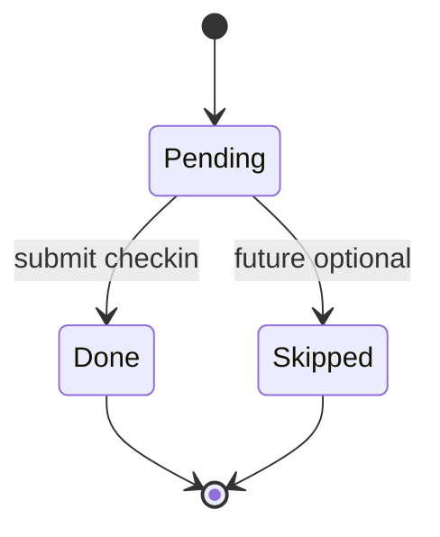
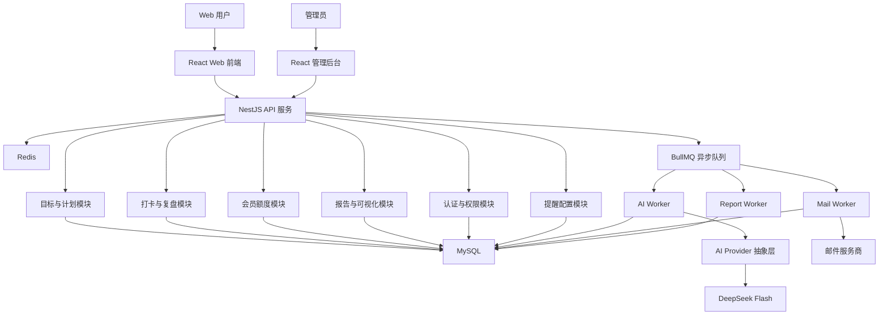
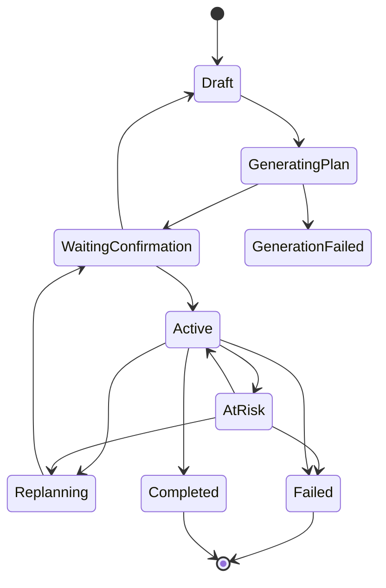
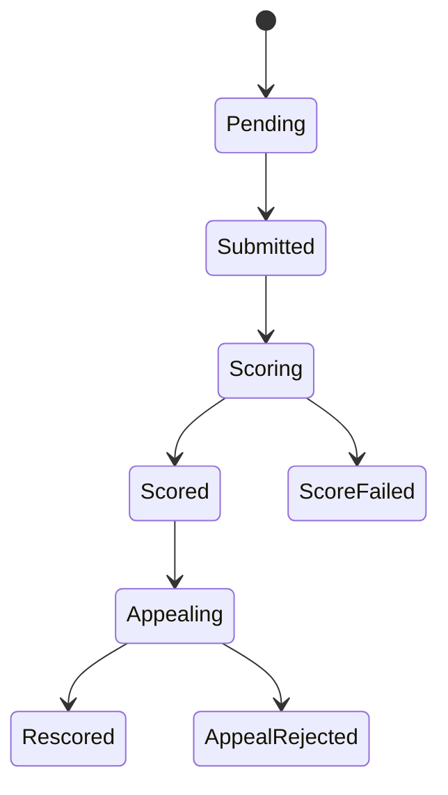
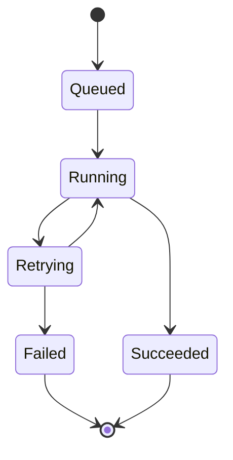

# GoalPilot AI SPEC

## 1. 项目定位

GoalPilot AI 是一个基于 AI 的学习计划与目标打卡平台，完整版重点面向学生和备考用户。用户输入一个长期学习或考试目标后，系统通过结构化表单和 AI 辅助追问，帮助用户拆解阶段计划、每周计划和每日任务，并在执行过程中提供每日打卡、复盘评分、计划偏差检测、动态调整建议、失败保护、救援任务、奖励愿景板、任务完成热力图、目标健康报告和成长时间线。

GoalPilot AI 不是普通 Todo List，也不是普通打卡网站。核心差异在于：

1. AI 目标拆解
2. 每日打卡与复盘
3. 基于规则约束的动态计划校正建议
4. 失败保护和救援任务机制
5. 目标奖励锚点和奖励愿景板
6. GitHub Contributions 风格的每日任务完成热力图
7. 目标健康报告和成长时间线

## 2. MVP 产品范围

### 2.1 首发平台

- 第一版只做 Web 端。
- 前后端分离。
- 小程序暂不开发，但后端接口设计预留多端能力。
- 完整版平台范围为 Web、微信小程序轻量版、邮件提醒和微信提醒。

### 2.2 首发用户场景

产品愿景保持泛化，但完整版聚焦学习计划及目标打卡，MVP 优先支持以下可拆解、可每日执行、可复盘的目标类型：

- 学习考证
- 职业技能成长
- 健身减脂
- 自律习惯

完整版第一优先级学习场景：

- 考研备考。
- 四六级备考。
- 雅思 / 托福备考。
- 绩点提升到目标分数。
- 自定义学习目标。

系统允许用户自由输入目标，由 AI 自动识别目标类型并补齐结构化信息。

### 2.3 MVP 核心闭环

MVP 第一验收目标是完整跑通：

创建目标 -> AI 拆解计划 -> 用户确认 -> 每日任务执行 -> 文本打卡 -> AI 多维评分 -> 偏差检测 -> 救援或调整建议 -> 目标完成或失败复盘。

## 3. 成功标准

### 3.1 产品成功指标

- 用户能够完成从目标创建到执行闭环的完整流程。
- 用户能够理解并接受 AI 拆解出的阶段计划、每周计划和每日任务。
- 用户每日打卡后能在 1 分钟内获得 AI 评分或明确的异步处理状态。
- 系统能根据未完成、低评分、延期、低投入、负面复盘内容等信号触发偏差提醒。
- 用户在失败后能看到失败复盘，并能重新开启新目标。

### 3.2 MVP 规模目标

- 先支持约 100 名用户。
- AI 目标生成在 1 分钟内返回结果或进入失败提示。
- AI 打卡评分在 1 分钟内返回结果或进入失败提示。

## 4. 用户角色

### 4.1 前台用户

普通用户可以：

- 邮箱注册和登录。
- 创建长期目标。
- 查看目标列表并切换当前目标。
- 填写目标约束信息。
- 查看 AI 生成计划。
- 确认计划后进入执行。
- 每日查看任务。
- 提交文本打卡内容。
- 查看 AI 评分和总结建议。
- 查看热力图、成长时间线、健康报告。
- 设置提醒偏好。
- 管理奖励愿景板。
- 对 AI 评分发起申诉复评。
- 在目标失败后查看失败报告，并重新开启新目标。

### 4.2 会员用户

会员用户在普通用户基础上获得更高额度：

- 更多进行中目标数量。
- 更多 AI 生成和评分次数。
- 更多申诉次数。
- 更完整的目标健康报告。
- 更高级的奖励愿景板能力。

MVP 不接入真实支付，只保留会员状态字段，由后台手动开通。

### 4.3 后台角色

后台建议分为三级权限：

- 运营管理员：用户基础信息、目标状态、邮件日志、会员状态管理。
- 系统管理员：异步任务、AI 调用日志、系统配置、异常任务处理。
- 超级管理员：可在审计记录下查看用户原始目标、复盘内容、敏感内容和完整审计日志。

后台入口可见性：

- 只有 `admin_users.status=ACTIVE` 的管理员账号登录 Web 后，前端才显示“后台管理”导航入口。
- 普通用户、会员用户和被禁用的管理员账号不显示后台管理入口。
- 即使绕过前端入口直接请求后台接口，后端仍必须通过管理员权限校验拦截。

## 5. 核心用户流程

### 5.1 注册登录

- MVP 使用邮箱注册和登录。
- 支持邮箱验证码或邮箱密码登录，具体实现可在技术设计阶段二选一。
- 用户登录后默认进入创建目标引导页。
- Web 保存本地 session token，页面刷新后通过 `GET /auth/me` 恢复当前用户、会员额度和 `adminRole`，无效 token 自动清除。

### 5.2 创建目标

创建目标采用“表单 + AI 辅助”模式。

用户需要填写：

- 目标描述
- 开始日期
- 结束日期
- 目标天数
- 每日可投入时间
- 当前基础
- 主要限制
- 允许断签或失败容错次数
- 最终奖励
- 阶段奖励
- 每日邮件提醒时间

AI 负责：

- 识别目标类型。
- 判断目标是否可拆解、可每日执行、可复盘。
- 发现目标时间、投入或难度是否明显不现实。
- 必要时生成补充问题。
- 生成长期目标拆解计划。

如果目标明显不现实，系统强提醒，但允许用户继续创建。

### 5.2.1 目标列表和当前目标

用户可以查看自己创建的目标列表，列表至少展示：

- 目标标题和描述
- 目标状态
- 目标类型
- 起止日期
- 容错次数

前端需要维护“当前选中目标”。今日任务、热力图、健康报告、计划确认等页面默认围绕当前选中目标展示。

当前目标驾驶舱需要作为目标列表页的主工作区，至少展示：

- 当前目标标题、描述和状态。
- 今日任务完成进度。
- 目标健康度、连续执行和容错剩余等关键指标。
- 最近 3 条复盘记录，包含任务标题、日期、投入时间和 AI 评分。
- 下一步主动作：生成 AI 计划、确认计划、完成今日任务或查看成长记录。
- 快速入口：今日任务、成长热力图、成长时间线、奖励愿景板。

默认选择规则：

1. 优先选择最近的 ACTIVE 或 AT_RISK 目标。
2. 没有进行中目标时，选择最近的 WAITING_CONFIRMATION 目标。
3. 仍没有时，选择最近创建的草稿目标。
4. 没有目标时，引导用户创建目标。

MVP 可以限制免费用户同时只有 1 个进行中目标，但目标列表仍需保留历史目标和草稿目标。

### 5.3 AI 计划拆解

计划层级：

1. 长期目标
2. 阶段里程碑
3. 每周计划
4. 每日任务

AI 生成计划后必须由用户确认。用户确认前，计划不进入执行状态。

AI 计划确认页需要完整展示：

- 计划摘要。
- 阶段里程碑。
- 每周计划。
- 每日任务标题、描述、日期和预计投入。
- 计划统计：里程碑数、周计划数、每日任务数、确认状态。
- 确认前检查项：阶段目标是否清晰、每周节奏是否可执行、每日任务是否具体、投入时间是否符合现实约束。

计划确认页必须支持从后端重新读取当前目标计划，避免用户刷新页面后丢失待确认计划。

### 5.4 每日任务和打卡

每日任务由系统按计划生成。

当用户存在多个目标时，今日任务接口和页面必须支持按当前目标过滤，避免不同目标的任务混在一起。

MVP 打卡只支持文本内容，包含：

- 今日完成了什么
- 投入时间
- 完成证据或过程描述
- 遇到的问题
- 主观状态和复盘

用户提交后，后端创建 AI 评分任务。

MVP 阶段先使用 Mock AI scorer：

- 创建 `CHECKIN_SCORING` 类型的 AiJob。
- 状态流转复用 `QUEUED / RUNNING / SUCCEEDED / FAILED`。
- Mock scorer 根据复盘文本长度、实际投入时间和计划投入时间生成总分、维度分、总结和建议。
- 评分结果写入 `ai_scores`，并和 `checkins` 关联。

打卡提交后前端展示复盘结果面板，至少包含：

- 完成内容
- 实际投入时间
- Mock AI 总分和维度分
- AI 总结和明日建议
- 评分 job 状态
- 对热力图和健康度更新的提示

### 5.5 AI 多维评分

AI 对每日完成情况进行多维评分，并给出证据和建议。

建议评分维度：

- 任务完成度
- 投入时长匹配度
- 完成质量
- 目标相关性
- 复盘深度
- 连续性和执行稳定性

输出内容：

- 各维度分数
- 总分
- 评分证据
- 今日总结
- 明日建议
- 风险提示

前端需要提供类似雷达图、柱状图或环形维度图的可视化，不强制必须是六边形图。

### 5.6 AI 评分申诉

用户不能手动修改评分。

用户可以发起 AI 申诉复评，但申诉必须基于新增事实：

- 追加完成证据
- 追加投入说明
- 纠正原打卡中遗漏的信息

AI 复评约束：

- 只依据任务要求、原始提交内容和新增事实。
- 不被情绪化话术、威胁、讨好、诱导性提示影响。
- 每个维度必须使用固定 rubric。
- 每项评分必须给出证据。
- 无新增事实的申诉应维持原评分。

### 5.7 偏差检测

系统同时使用规则和 AI 识别偏差。

偏差信号包括：

- 连续未完成天数
- 累计未完成次数
- 完成分数低于阈值
- 任务延期
- 实际投入低于计划
- 阶段里程碑进度落后
- 复盘中出现“太难”“没时间”“不想做”“压力大”等负面信号
- 容错次数即将耗尽

偏差处理：

- 轻度偏差：提示风险和明日建议。
- 中度偏差：建议降低难度、调整任务粒度或生成救援任务。
- 重度偏差：触发重规划建议。
- 超过容错次数：判定当前目标失败。

MVP 偏差检测先使用规则引擎，输出统一 `deviation` 信号：

- `eventId`: 偏差事件 ID；稳定状态下为空。
- `detectedAt`: 偏差事件检测时间；稳定状态下为空。
- `riskLevel`: `stable / warning / danger`。
- `reasons`: 触发原因数组，原因码包括 `LOW_SCORE / LOW_INVESTMENT / BROKEN_STREAK / TASK_DELAY`。
- `metrics`: 最近平均分、近 7 天实际投入、近 7 天预期投入、连续天数、延期任务数、今日未完成任务数。

MVP 触发规则：

- 低评分：近 7 天平均 AI 评分低于 70 触发 `warning`，低于 60 触发 `danger`。
- 低投入：近 7 天实际投入低于预期投入 80% 触发 `warning`，低于 50% 触发 `danger`。
- 断签：连续完成天数为 0 且存在今日任务或近 7 天复盘记录时触发；若今日仍有未完成任务，触发 `danger`。
- 任务延期：今天之前仍未完成的任务数大于 0 触发 `warning`，大于等于 3 触发 `danger`。

MVP 偏差事件持久化：

- 新增 `deviation_events` 表保存偏差检测结果。
- 仅当 `riskLevel` 为 `warning` 或 `danger` 时写入事件；`stable` 不生成偏差事件。
- 事件保存 `goalId`、可选 `sourceDailyTaskId`、风险等级、主触发原因、完整 `reasons` JSON、`metrics` JSON 和 `detectedAt`。
- 为避免健康报告反复刷新制造重复数据，同一目标、同一自然日、同一主触发原因复用同一偏差事件，并更新最新指标快照。
- 健康报告和救援任务接口返回的 `deviation.eventId` 指向该偏差事件，后续时间线、趋势和救援效果统计均以此作为链路入口。

### 5.8 救援任务机制

救援任务用于防止用户因为一次低质量执行直接放弃。

触发条件：

- 当日任务未完成。
- 当日评分明显低于阈值。
- 用户接近断签。
- 用户复盘中表现出强阻力。

救援任务特征：

- 更小。
- 更短。
- 更低门槛。
- 能维持目标连续性。
- 不替代原计划，只作为恢复执行状态的最小任务。

示例：

- 原任务：学习 2 小时。
- 救援任务：学习 15 分钟并写下 3 个知识点。

MVP 新增接口：

- `POST /goals/:id/rescue-task`
- 请求需要登录态，不需要请求体。
- 响应包含 `goalId`、`goalTitle`、最新 `deviation` 和 `rescueTask`。

MVP `rescueTask` 字段：

- `id`: 已持久化的每日任务 ID。
- `title`: 补救任务标题。
- `description`: 低压力执行说明。
- `estimatedMinutes`: 预计投入时间，建议 10-25 分钟。
- `reason`: 生成原因，来自主要偏差信号。
- `triggerCode`: 触发原因码，稳定状态下可为空。
- `riskLevel`: 生成时的偏差风险等级。
- `sourceDailyTaskId`: 可选，指向触发补救的未完成或延期任务。
- `deviationEventId`: 可选，指向触发该救援任务的偏差事件。
- `status`: 复用每日任务状态。
- `createdAt`: 生成时间。

MVP 持久化策略：

- 不新增独立 `RescueTask` 表，先在 `daily_tasks` 增加 `taskType` 和救援元数据字段。
- 普通任务 `taskType=NORMAL`，救援任务 `taskType=RESCUE`。
- 救援任务保存标题、说明、预计时间、触发原因、风险等级、状态、`goalId`、可选 `sourceDailyTaskId` 和可选 `deviationEventId`。
- `POST /goals/:id/rescue-task` 生成后直接创建或复用当日未完成救援任务，并返回已持久化的任务对象。
- 若当日已存在未完成救援任务，则复用该任务和已关联的偏差事件；若是旧数据缺少 `deviationEventId`，会补写当天对应偏差事件。
- 前端今日任务列表直接读取后端任务，不再维护临时救援任务。

状态流转：

完成闭环：

- 救援任务完成接口复用 `POST /daily-tasks/:id/complete`。
- 完成时创建 `checkins`，创建 `CHECKIN_SCORING` AiJob，并写入 `ai_scores`。
- 评分证据中保留 `taskType=RESCUE`、`deviationEventId`、触发原因码和生成时风险等级。
- 完成后刷新今日任务、健康报告、热力图和成长时间线。

MVP 联调结论：

- 2026-06-09 已通过本地完整链路联调：注册登录、创建目标、生成并确认计划、制造低投入和今日未完成偏差、读取健康报告、生成救援任务、重复生成复用未完成救援任务、完成救援任务后再次生成新救援任务。
- 健康报告中的 `deviation.eventId` 在同一目标、同一自然日、同一主触发原因下稳定复用。
- 救援任务创建后，`daily_tasks.deviationEventId` 与 `deviation_events.id` 保持一致。
- 同日未完成救援任务会被复用；该任务完成后，再次生成会创建新的 `RESCUE` 任务，并继续关联当天同一偏差事件。
- 今日任务页面已能同时展示原计划任务、已完成救援任务和新的待完成救援任务；成长时间线已能展示已完成救援任务复盘、触发原因和补救建议。
- 当前时间线仍以“救援任务复盘”为主，尚未拆成“触发偏差 -> 系统介入 -> 救援任务完成”的完整偏差链路视图。

MVP 自动化验证：

- 2026-06-11 已新增 `GoalsService.generateRescueTask` 后端集成测试。
- 测试覆盖有偏差时创建 `deviation_events`。
- 测试覆盖同日同主原因复用偏差事件。
- 测试覆盖同日未完成救援任务复用，以及救援任务完成后可新建。
- 可通过仓库根目录执行 `npm run test:integration` 运行集成测试；该测试需要本地 MySQL 可访问。

### 5.9 目标失败

目标失败规则：

- 到达结束日期前，未完成不会立刻判定整体失败。
- 用户创建目标时可设置容错次数。
- 超过容错次数后，当前目标判定失败。

目标失败后：

- 当前目标进入失败状态。
- 系统生成失败总结复盘。
- 旧目标保留为历史参考。
- 用户可以重新开启一个全新的目标。
- 新目标和旧目标不是同一目标版本关系，而是新的目标记录。

失败报告应包含：

- 失败原因分析
- 断签时间线
- 低分任务列表
- 关键偏差节点
- AI 复盘建议
- 重新开启计划入口

### 5.10 目标完成

目标完成规则：

- 到达结束日期。
- 未超过容错次数。

不额外强制要求平均分、累计完成率或里程碑完成率达到阈值。相关指标作为健康报告展示。

### 5.11 计划修改

用户可在执行中申请修改：

- 结束日期
- 每日投入时间
- 奖励
- 任务难度
- 计划节奏

修改不能直接生效，必须触发 AI 重新评估并生成新计划。

新计划需要用户确认后生效。

## 6. 奖励愿景板

奖励愿景板用于增强目标锚定感。

MVP 支持：

- 最终奖励
- 阶段奖励
- 文字奖励卡片
- 图片上传
- 外链图片
- 愿望卡片排序

奖励触发：

- 达成阶段里程碑时提醒阶段奖励。
- 最终目标完成时提醒最终奖励。

## 7. 热力图和成长可视化

### 7.1 热力图

热力图采用类似 GitHub Contributions 的日历式布局。

当用户存在多个目标时，热力图默认展示当前选中目标的数据。用户切换当前目标后，热力图、日期详情和健康报告需要同步切换。

点击某天方块时，日期详情需要展示当天所有复盘记录和 AI 建议，并提供跳转到当天成长时间线记录的入口。

颜色深浅综合参考：

- AI 总评分
- 任务完成比例
- 投入时长
- 目标健康度

热力图不只展示是否完成。

### 7.2 目标健康报告

健康报告基础版包含：

- 当前目标状态
- 总体完成率
- 平均 AI 评分
- 容错次数剩余
- 连续执行天数
- 低分日期
- 偏差趋势
- AI 风险建议
- 偏差风险等级和触发原因
- 救援任务生成入口
- 近 7 天救援成功次数
- 救援任务完成率
- 普通任务完成率
- 救援后次日是否回到正常计划

健康报告和今日任务联动：

- 健康报告接口返回 `deviation`，前端根据 `riskLevel` 展示稳定、预警或危险状态。
- 当 `riskLevel` 为 `warning` 或 `danger` 时，今日任务页顶部显示偏差提醒，列出触发原因。
- 用户可以从健康报告风险卡片或今日任务页生成救援任务。
- 生成后的救援任务作为 `taskType=RESCUE` 的正式每日任务出现在今日任务列表顶部或同日任务流中，不替代原计划任务。
- 救援任务完成后计入当日完成数、热力图等级、投入分钟、平均评分和健康度计算。
- 未完成救援任务也参与今日未完成任务与偏差检测，避免生成后无人处理。
- 健康报告的 `deviation.eventId` 是救援任务、成长时间线和后续救援统计的统一链路 ID。

MVP 已验证的健康报告细化：

- `GET /goals/:id/health` 返回 `rescueSuccessCount7d`、`rescueTaskCompletionRate`、`normalTaskCompletionRate`、`rescueNextDayRecovered`、`completionMetrics`、`rescueMetrics`、`healthWeights` 和当日 `snapshot`。
- 健康度公式继续使用今日完成率、本周完成率、连续天数、近 7 天平均 AI 评分、容错余额和风险扣分；接口同时声明任务类型权重：普通任务权重 `1`，救援任务权重 `0.6`。普通任务代表原计划执行，救援任务用于恢复节奏，救援完成计入健康度和热力图但不替代普通任务。
- `rescueNextDayRecovered` 以最近完成的救援任务为入口，检查次日普通任务完成率是否达到 50%；若次日尚未到来或没有普通任务，返回 `null`。

MVP 已落地每日健康快照：

- 新增 `health_snapshots` 表，按 `goalId + date` 唯一保存每日健康快照。
- 快照字段包括 `goalId`、北京时间自然日 `date`、`healthScore`、可选 `deviationEventId`、`completionMetrics`、`rescueMetrics` 和 `riskLevel`。
- 每次读取健康报告会 upsert 当日快照，刷新不会产生重复快照。
- 预留趋势接口：`GET /goals/:id/health-snapshots`，返回当前用户当前目标最近快照列表。
- 2026-06-11 已补充 `GoalsService health snapshots integration`，验证救援统计、普通任务完成率、次日恢复判断、当日快照 upsert 和趋势接口读取。

### 7.3 成长时间线

时间线展示：

- 目标创建
- 计划确认
- 阶段里程碑
- 每日关键打卡
- 偏差提醒
- 救援任务
- 计划重评估
- 目标完成或失败

MVP 优先实现基于每日复盘的成长时间线：

- 后端提供 `GET /daily-tasks/timeline?goalId=...`。
- 接口按当前用户授权读取数据，并支持按当前目标过滤。
- 返回最近完成任务、checkin、aiScore、日期、投入时间、目标标题、周计划标题和任务标题。
- 返回数据需要同时包含扁平 `items` 和按日期聚合的 `days`，便于页面和热力图详情复用。
- 每条记录至少展示任务标题、复盘摘要、投入时间、AI 总分、AI 总结和 AI 建议。
- 救援任务复盘必须标记“救援任务复盘”，展示触发原因、风险等级和补救效果。
- 空状态引导用户先完成今日任务。

下一阶段时间线应使用 `deviationEventId` 展示完整偏差链路：

- 触发偏差：展示主触发原因、风险等级和关键指标快照。
- 系统介入：展示生成或复用的救援任务，以及是否为同日复用。
- 救援完成：展示救援任务完成时间、AI 评分、投入分钟和后续健康度变化。

成长时间线需要和现有页面联动：

- 热力图选中某天后，详情区展示当天所有复盘和建议，并可跳转到时间线当天记录。
- 当前目标驾驶舱展示最近 3 条复盘记录，点击后进入对应日期的成长时间线。
- 切换当前目标后，今日任务、热力图、健康报告和成长时间线都必须同步切换。

## 8. 邮件提醒

MVP 使用邮件提醒。

用户可配置：

- 是否开启邮件提醒
- 每日提醒时间
- 接收哪些提醒类型

提醒类型：

- 每日任务提醒
- 当天未打卡提醒
- 容错次数即将耗尽提醒
- 阶段里程碑提醒
- 失败复盘提醒
- 会员到期提醒

截止时间规则：

- 截止时间严格按自然日计算。
- 默认使用北京时间。
- 用户可以自定义提醒时间，但不改变当日截止规则。

MVP 已落地的提醒日志和重试能力：

- `email_logs` 新增 `attempts` 字段，记录每条邮件提醒实际发送尝试次数。
- `POST /notifications/email-logs/enqueue-due` 可根据当前用户提醒偏好、当天任务、当天完成情况、容错次数、里程碑、失败复盘和会员到期状态生成当天邮件日志。
- 每日学习提醒和未打卡提醒会附带短鼓励文案；文案根据当天已完成任务数和待完成任务数生成，例如“先做10分钟，也算重新开始。”。
- `POST /notifications/email-logs/process-queue` 处理当前用户已到期的 `QUEUED` 邮件日志，通过 MailProvider 发送，成功写入 `SENT` 和 `sentAt`，失败写入 `FAILED`、`error` 并累计 `attempts`。
- `POST /notifications/email-logs/retry-failed` 可将当前用户 `attempts < 3` 的失败邮件重新排队，后续再次处理队列时继续累计尝试次数。
- Web 账号页已提供生成今日提醒、处理发送队列和重试失败邮件的基础操作入口，并在邮件日志中展示尝试次数。
- `notification_preferences.channels` 预留提醒渠道，支持 `WEB / EMAIL / WECHAT`；`email_logs.channel` 记录具体投递渠道。
- `wechat_bindings` 预留 Web 账号与微信 openid / unionid 绑定关系；已提供绑定、解绑和查询接口。
- 当用户同时启用 EMAIL 与 WECHAT 且已绑定微信时，提醒生成会分别写入 EMAIL 和 WECHAT 渠道日志；当前发送队列只处理 EMAIL，WECHAT 日志保留给后续微信 provider 消费。
- `NotificationsWorker` 已在 `BULLMQ_WORKERS_ENABLED=true` 时监听 BullMQ `email` 队列，并按 `emailLogId` 调用 `processQueuedEmailLog` 处理单条到期邮件日志。
- worker 路径发送失败时会累计 `attempts`；非最终 BullMQ attempt 会保持日志为 `QUEUED` 并抛错交给 BullMQ attempts/backoff 退避重试，最终 attempt 才落库为 `FAILED`。
- 剩余风险：当前仍使用 MockMailProvider，尚未接入真实邮件服务商和微信服务商；WECHAT 日志尚未接入真实微信 provider 或订阅消息模板。

## 9. 商业化

MVP 不接入真实支付。

商业化能力包括：

- 用户会员状态字段
- 会员到期时间
- 后台手动开通会员
- 免费版额度限制
- 会员版额度解锁

建议免费版限制：

- 仅允许 1 个进行中目标。
- 每日 AI 评分次数有限。
- 每周 AI 调整建议次数有限。
- 申诉次数有限。
- 目标健康报告为基础版。
- 奖励愿景板素材数量有限。

建议会员版能力：

- 多个进行中目标。
- 更多 AI 评分、复盘、调整建议。
- 更多申诉次数。
- 深度健康报告。
- 高级奖励愿景板。

MVP 已落地的会员额度统计：

- 免费版进行中目标上限为 1，PRO 进行中目标上限为 5，确认计划时由后端统一校验。
- `AuthService` 在注册、登录和 `GET /auth/me` 返回 `quota`，包含当前会员计划、是否具有 PRO 权益、进行中目标使用量、今日 AI job 使用量、本周重规划使用量和本周评分申诉使用量。
- MVP 阶段 AI 次数先作为统计和前端展示，不强制拦截所有 AI job；进行中目标额度已经强制校验。
- 前端账号页展示进行中目标、今日 AI 次数、本周重规划和本周申诉额度。
- 2026-06-11 已补充 `AuthService quota integration`，验证当前用户 quota 和 AI usage 统计。

## 10. 管理后台

后台 MVP 功能：

- 用户管理
- 目标列表
- 目标状态查看
- AI 调用记录
- 异步任务状态
- 失败 AI job 手动重试
- 会员管理
- 邮件提醒日志
- 系统配置
- 敏感内容和异常内容查看
- 审计日志

后台入口和权限：

- `AuthService` 在注册、登录和 `GET /auth/me` 返回 `adminRole`，仅当用户存在 ACTIVE 管理员身份时返回角色，否则返回 `null`。
- Web 前端根据注册、登录或刷新恢复后的 `adminRole` 决定是否显示“后台管理”导航入口；普通用户账号不显示该选项。
- 管理后台接口继续由后端管理员权限校验保护，前端隐藏入口不是安全边界。

隐私约束：

- 默认后台页面优先展示摘要、状态和指标。
- 超级管理员查看用户原文必须记录审计日志。
- 审计日志记录查看人、查看时间、查看原因、查看对象。
- 管理员手动重试失败 AI job 必须填写原因，并写入审计日志。

已落地的后台 AI job 重试能力：

- `POST /admin/ai-jobs/:jobId/retry` 允许 ACTIVE 管理员重试 `FAILED` 状态的 AI job。
- 重试会把 job 重新置为 `QUEUED`、清空错误、重置 attempts，并在 payload 中写入 `adminRetry` 元数据，包括重试人、原因、原状态、原错误、原尝试次数和队列入队结果。
- 接口会调用 BullMQ `ai-jobs` 队列；当 `BULLMQ_ENABLED=false` 或队列未配置时，仍保留 `queued=false` 原因，方便管理员知道任务已标记但等待 worker 能力补齐。
- Web 后台 AI jobs 列表对 `FAILED` job 展示“重试”按钮，重试后刷新 AI job 和审计日志。
- 已新增 `AdminService integration` 用例，覆盖重试原因校验、非失败 job 拒绝、状态流转、payload 元数据和 `AI_JOB_RETRY` 审计日志。

已落地的后台用户搜索能力：

- `GET /admin/users` 支持 `query`、`status`、`plan` 和 `adminRole` 筛选参数。
- `query` 会匹配邮箱和昵称；`status` 支持 `ACTIVE`、`DISABLED`、`DELETED`；`plan` 支持 `FREE`、`PRO`；`adminRole` 支持 `OPERATOR`、`SUPER_ADMIN` 且只匹配 ACTIVE 后台身份。
- Web 后台用户与会员面板提供搜索输入、用户状态、会员计划和后台角色筛选，并展示当前返回数 / 匹配总数。
- 已新增 `AdminService integration` 用例，覆盖 query、会员计划、用户状态、后台角色筛选和非法筛选值拒绝。

已落地的后台列表筛选能力：

- `GET /admin/goals` 支持 `query`、`status` 和 `category` 筛选，`query` 覆盖目标标题、目标描述、用户邮箱和昵称。
- `GET /admin/ai-jobs` 支持 `query`、`status` 和 `type` 筛选，`query` 覆盖 job 类型、用户邮箱、用户昵称和目标标题。
- `GET /admin/email-logs` 支持 `query`、`status`、`type` 和 `channel` 筛选，`query` 覆盖收件人、主题、类型、用户邮箱和昵称。
- 后台邮件日志返回 `channel` 字段，Web 后台可区分 EMAIL / WECHAT / WEB 渠道。
- Web 后台目标、AI jobs 和邮件日志区块已提供对应筛选表单，并展示当前返回数 / 匹配总数。
- 已新增 `AdminService integration` 用例，覆盖目标、AI job、邮件日志筛选和非法分类 / 状态 / 渠道拒绝。

## 11. 隐私和安全

MVP 需要重视私人目标、复盘内容和奖励愿景板数据。

基础要求：

- 用户可删除自己的目标数据。
- 用户可删除账号及全部数据。
- AI 调用前尽量减少不必要个人身份信息。
- 敏感内容加密存储，至少对关键字段预留加密能力。
- 后台权限分级。
- 超级管理员查看原文需审计。
- 记录关键操作审计日志。

MVP 已落地的隐私删除能力：

- `DELETE /goals/:id` 允许用户删除自己的目标，并级联删除目标下任务、复盘、评分、偏差事件、救援任务、奖励卡片、失败报告和健康快照；与目标相关但不由外键级联的邮件日志会清空 `goalId`，保留投递审计历史。
- `DELETE /auth/me` 允许当前登录用户删除账号，并通过 Prisma cascade 删除用户下目标、会员、提醒偏好、邮件日志、AI jobs、申诉、管理员身份和审计记录等关联数据。
- 前端目标驾驶舱提供“删除目标”入口，账号页提供“删除账号”入口，均需要浏览器确认。
- 2026-06-12 已补充 `GoalsService privacy deletion integration` 和 `AuthService quota integration` 中的账号删除测试，验证权限隔离、目标级联删除和账号级联删除。

## 12. 技术架构

### 12.1 技术选型

前端：

- React
- TypeScript
- Vite

后端：

- NestJS
- TypeScript

数据库：

- MySQL

缓存和异步队列：

- Redis
- BullMQ

AI：

- DeepSeek Flash 作为主要 AI 供应商
- 后端保留 AI Provider 抽象，支持未来切换模型供应商

邮件：

- 通过邮件服务商发送提醒邮件
- 邮件发送任务进入异步队列

### 12.2 架构图

### 12.3 后端模块

- Auth Module：邮箱注册、登录、会话、权限。
- User Module：用户资料、提醒偏好、隐私设置。
- Goal Module：目标创建、目标状态、容错次数、完成或失败。
- Plan Module：阶段计划、每周计划、每日任务、计划确认、计划重评估。
- Checkin Module：每日打卡、文本内容、评分状态。
- Scoring Module：AI 评分、rubric、申诉复评。
- Deviation Module：偏差检测、救援任务、风险等级。
- Reward Module：奖励愿景板、图片、外链、排序。
- Heatmap Module：热力图数据聚合。
- Report Module：健康报告、成长时间线、失败报告。
- Membership Module：会员状态、额度限制。
- Admin Module：后台管理、审计日志。
- Notification Module：邮件提醒配置和发送日志。
- AI Provider Module：模型供应商抽象、调用记录、重试、失败终止。
- Queue Module：异步任务调度。

## 13. 关键数据模型

核心表建议：

- users
- user_auth_identities
- user_preferences
- memberships
- goals
- goal_constraints
- plans
- milestones
- weekly_plans
- daily_tasks
- checkins
- ai_scores
- ai_score_dimensions
- score_appeals
- deviation_events
- rescue_tasks（后续独立表；MVP 使用 `daily_tasks.taskType=RESCUE`）
- reward_boards
- reward_cards
- heatmap_daily_stats
- health_snapshots
- health_reports
- timeline_events
- notifications
- email_logs
- ai_jobs
- ai_call_logs
- admin_users
- admin_roles
- audit_logs
- system_configs

MVP 已落地的偏差和救援相关字段：

- `deviation_events`: 记录目标偏差事件、主触发原因、风险等级、完整原因 JSON、指标快照 JSON、检测时间和可选来源任务。
- `daily_tasks.taskType`: 区分 `NORMAL` 和 `RESCUE`。
- `daily_tasks.sourceDailyTaskId`: 记录救援任务来源的延期或未完成任务 ID。
- `daily_tasks.deviationEventId`: 记录救援任务对应的偏差事件 ID。
- `daily_tasks.rescueReason / rescueTriggerCode / rescueRiskLevel`: 保存救援任务生成时的偏差信号摘要。
- `health_snapshots`: 保存每日健康度、偏差事件 ID、完成率指标、救援统计和风险等级；用于健康趋势图和救援后恢复轨迹。

## 14. 状态机

### 14.1 目标状态

### 14.2 每日打卡状态

### 14.3 AI 异步任务状态

## 15. AI 任务和失败兜底

AI 任务包括：

- 目标类型识别
- 目标可行性判断
- 阶段计划生成
- 每日任务生成
- 打卡评分
- 申诉复评
- 偏差总结
- 救援任务生成
- 计划重评估
- 健康报告生成
- 失败报告生成

失败处理：

- AI 调用超时或失败时自动重试。
- 用户侧显示“生成中”或“评分中，请稍后查看”。
- 超过最大失败次数后终止任务。
- 终止后提示用户“生成失败”或“评分失败”。
- 后台记录异常任务，便于管理员排查。

MVP 已落地的 AI Provider 和队列基础版：

- 后端新增 `PlanProvider` 抽象，`AiJobsService` 通过 provider 生成计划，重试和失败终止逻辑继续复用 `ai_jobs` 状态机。
- 默认 provider 为 Mock；当 `AI_PROVIDER=deepseek` 且配置 `DEEPSEEK_API_KEY` 时，Nest provider factory 会选择 DeepSeek provider。无 API key 时自动 fallback 到 Mock，保证本地和测试环境稳定可跑。
- DeepSeek provider 调用 `https://api.deepseek.com/chat/completions`，默认模型为 `deepseek-chat`，可用 `DEEPSEEK_MODEL` 覆盖；返回内容要求为计划 JSON，并解析为现有 `Plan/Milestone/WeeklyPlan/DailyTask` 数据结构。
- 新增 BullMQ 队列基础服务，依赖 Redis，配置 `BULLMQ_ENABLED=true` 后可向 `ai-jobs` 和 `email` 队列入队；默认关闭时返回明确 disabled 状态，不破坏当前同步 Mock MVP 链路。
- 新增 `GET /ai-jobs/:id`，前端可按 job id 查询自己的 AI 任务状态；跨用户读取返回不存在。
- 前端计划页和打卡复盘弹窗已接入最近 AI 任务状态面板，计划生成、重规划、打卡评分和评分申诉都会记录最近 job，并可通过刷新按钮调用 `GET /ai-jobs/:id` 获取最新状态。
- 计划生成和重规划创建 `ai_jobs` 后会尝试写入 BullMQ `ai-jobs` 队列，并把队列结果写入 job payload；队列不可用不会破坏当前同步生成链路。
- 打卡评分新增 `ScoringProvider` 抽象，默认使用 `MockScoringProvider`；评分创建 `CHECKIN_SCORING` job 后会尝试写入 BullMQ `ai-jobs` 队列，并在 payload 中保留 provider 与 queue 元数据。
- 邮件提醒新增 `MailProvider` 抽象，默认使用 `MockMailProvider`；邮件日志创建后会尝试写入 BullMQ `email` 队列，邮件处理通过 provider 返回发送成功或失败。
- 2026-06-12 已补充 AI job provider payload、job 状态权限隔离、评分 provider/queue payload、MailProvider 注入、QueueService 默认关闭、Redis 实际入队测试和前端 job 状态刷新展示；`npm run typecheck`、`npm run test:integration`、`npm run build` 已作为验收命令。

## 16. API 边界

前端职责：

- 页面展示
- 表单交互
- 打卡提交
- 可视化展示
- 用户配置

后端职责：

- 认证和权限
- 所有 AI 调用
- 评分规则和 rubric
- 反诱导约束
- 偏差检测
- 目标状态流转
- 会员额度控制
- 邮件提醒调度
- 审计日志

原则：

- 前端不直接调用 AI。
- 前端不自行计算关键目标状态。
- 前端不拥有评分最终解释权。
- 规则、AI 调用和数据一致性由后端统一控制。

## 17. UI/UX 要求

整体风格：

- 温暖陪伴型。
- 不做冰冷的普通 Todo List。
- 不做纯游戏化，但允许适度成长感和奖励感。

登录后第一屏：

- 未创建目标时展示创建目标引导页。
- 已有进行中目标时可进入当前目标驾驶舱。
- 已有多个目标时，系统根据默认选择规则选中当前目标，并允许用户从目标列表切换。

核心页面：

- 创建目标引导页
- 目标列表页
- AI 计划确认页
- 当前目标驾驶舱
- 今日任务页
- 打卡复盘页
- AI 评分结果页
- 热力图页
- 成长时间线页
- 健康报告页
- 奖励愿景板页
- 失败复盘页
- 个人设置页
- 会员状态页
- 管理后台

管理后台入口只对管理员账号显示。普通用户和会员用户登录后不显示“后台管理”选项；如果用户直接访问后台页面状态，前端展示无权限提示并切回账号页，后端接口继续返回无后台访问权限。

## 18. 非功能需求

性能：

- 目标生成和评分允许异步，目标在 1 分钟内有结果或失败提示。
- 常规页面接口应在 1 秒内返回。

可扩展性：

- 保留多端接口能力。
- AI Provider 可切换。
- 异步任务可横向扩展。

安全：

- 密码或邮箱登录凭证安全存储。
- 后台权限分级。
- 原文查看必须审计。
- 用户敏感内容和关键隐私字段预留加密。

成本：

- 使用 DeepSeek Flash 作为主模型控制成本。
- 规则检测优先，复杂建议再调用 AI。
- 对免费用户限制 AI 次数。

可靠性：

- AI 任务失败重试。
- 邮件发送失败记录和重试。
- 异步任务可追踪。

## 19. 边缘案例和异常处理

- 用户输入过于抽象目标：AI 提示需要改写为可拆解、可每日执行、可复盘目标。
- 用户目标时间明显不现实：强提醒，但允许继续。
- 用户未确认计划：目标保持待确认，不生成每日执行任务。
- 用户当天未打卡：记录未完成，按容错规则处理。
- 用户提交极短或无意义打卡：AI 按 rubric 给低分并说明证据不足。
- 用户诱导 AI 改分：申诉失败，维持原评分。
- 用户修改计划：进入重评估流程，新计划确认后才生效。
- AI 多次失败：终止任务，提示失败，后台记录异常。
- 邮件发送失败：记录失败日志并按策略重试。
- 超过容错次数：目标失败并生成失败报告。
- 到达结束日期且未超过容错次数：目标完成。

## 20. TODO 清单

### 20.1 产品设计

- 明确免费版和会员版额度数字。
- 设计目标创建表单。
- 设计 AI 追问和补全流程。
- 设计评分 rubric。
- 设计偏差等级和触发规则。
- 设计失败报告内容结构。
- 设计邮件提醒模板。
- 设计后台权限和审计交互。

### 20.2 前端

- 搭建 React + TypeScript + Vite 项目。
- 实现邮箱登录和注册页面。
- 实现创建目标引导页。
- 实现 AI 计划确认页。
- 实现当前目标驾驶舱。
- 实现今日任务和文本打卡。
- 实现 AI 评分展示和维度图。
- 实现热力图。
- 实现成长时间线。
- 实现健康报告。
- 实现奖励愿景板。
- 实现失败复盘页。
- 实现用户提醒配置页。
- 实现会员状态页。
- 实现管理后台基础页面。
- 已实现最近 AI 任务状态展示和手动刷新，覆盖计划生成、重规划、打卡评分、评分申诉链路。

### 20.3 后端

- 搭建 NestJS 项目。
- 设计 MySQL schema。
- 已接入 Redis/BullMQ 基础服务；默认关闭，设置 `BULLMQ_ENABLED=true` 后计划生成、打卡评分和邮件日志可入队 `ai-jobs` / `email` 队列。
- 实现认证和权限。
- 实现目标、计划、任务模型。
- 已实现 AI Provider 抽象层，计划生成可在 Mock 与 DeepSeek provider 间切换。
- 已接入 DeepSeek provider 配置入口；无 `DEEPSEEK_API_KEY` 时自动 fallback 到 Mock。
- 已实现计划生成异步任务记录、重试、状态查询和队列入队元数据。
- 已实现打卡评分异步任务记录、Mock ScoringProvider 和队列入队元数据。
- 实现评分申诉复评。
- 实现偏差检测规则。
- 实现救援任务生成。
- 实现目标完成和失败状态流转。
- 实现奖励愿景板接口。
- 实现热力图聚合接口。
- 实现健康报告和时间线。
- 已实现邮件提醒任务、MailProvider 抽象、邮件日志和队列入队元数据。
- 已实现会员额度限制和 AI 使用统计；进行中目标额度强制校验，AI job、重规划和申诉额度返回给前端展示。
- 实现后台管理接口。
- 实现审计日志。
- 已实现后台入口前端可见性控制：普通用户不显示后台管理导航，管理员账号根据 `adminRole` 显示入口。

### 20.4 运维和配置

- 配置环境变量。
- 配置数据库迁移。
- 配置日志。
- 配置异步任务监控。
- 配置邮件服务商。
- 配置 AI 调用超时和重试策略。
- 配置后台系统参数。

### 20.5 近期工程验证项

- 已补充 `generateRescueTask` 后端集成测试，覆盖有偏差时创建 `deviation_events`。
- 已补充同日同主原因复用偏差事件的集成测试。
- 已补充同日未完成救援任务复用、完成后可新建救援任务的集成测试。
- 已将成长时间线从“救援任务复盘”升级为“触发偏差 -> 系统介入 -> 救援任务完成”的偏差链路展示，并通过 `deviationEventId` 集成测试验证。
- 已明确救援任务完成率和普通任务完成率在健康报告中的权重，健康报告返回 `healthWeights.taskTypeWeights`。
- 已在健康报告增加近 7 天救援成功次数、救援任务完成率、普通任务完成率、救援后次日是否回到正常计划。
- 已新增每日健康快照表 `health_snapshots`，保存 `healthScore`、`deviationEventId`、completion metrics、rescue metrics 和 `riskLevel`，并预留 `GET /goals/:id/health-snapshots` 趋势接口。
- 2026-06-11 已通过 `npm run typecheck`、`npm run test:integration` 和 `npm run build` 验证阶段 2/3 后端、前端类型和构建。
- 2026-06-11 已通过 `npm run typecheck`、`npm run test:integration`（36/36）和 `npm run build` 验证 provider/queue 增量。
- 2026-06-11 已通过 `npm run typecheck`、`npm run test:integration`（37/37）和 `npm run build` 验证会员 quota/AI usage 增量。
- 2026-06-12 已通过 `npm run typecheck`、`npm run test:integration`（40/40）和 `npm run build` 验证隐私删除接口和前端入口。
- 2026-06-12 已新增 Playwright E2E 核心闭环测试，覆盖新用户注册、创建目标、生成计划、确认计划、完成普通任务、生成并完成救援任务、查看热力图、查看成长时间线，并通过 API 断言健康报告和 `deviationEventId` 时间线数据。
- 2026-06-14 已扩展 Playwright E2E 核心闭环：覆盖到期且容错未超的目标完成结算、到期且容错超限的失败复盘、失败报告 API 和重新开启新目标。
- 2026-06-12 已新增打卡证据字段和 Pro AI 分析解锁增量：`checkins` 保存完成子项、题量、正确题数、正确率、图片/文件证据、错题/笔记链接、学习状态和主观难度；免费用户仅返回基础评分和完成状态，Pro 用户返回维度评分、证据分析、AI 总结和建议。
- 2026-06-12 已补充 `DailyTasksService check-in evidence integration`，验证证据持久化、正确率计算、免费版 AI 分析脱敏、Pro 详细分析解锁、非法题量校验和跨用户任务隔离。
- 2026-06-12 已补充 `AuthService quota integration` 管理员身份返回验证；普通用户 `adminRole=null`，ACTIVE 管理员返回角色，Web 导航据此隐藏或显示后台入口。
- 2026-06-14 已补充 Playwright E2E 验收：普通用户登录后不显示“后台管理”导航入口，`admin_users.status=ACTIVE` 的管理员账号登录后显示后台入口。
- 2026-06-12 已新增邮件提醒鼓励文案和失败重试基础版：`email_logs.attempts` 记录发送尝试次数，`POST /notifications/email-logs/retry-failed` 支持失败日志重新排队，账号页提供重试入口；`NotificationsService integration` 覆盖每日/未打卡提醒鼓励文案、失败记录和重试后再次发送。
- 2026-06-12 已新增微信小程序预留数据结构和接口：`notification_preferences.channels` 支持 `WEB / EMAIL / WECHAT`，`email_logs.channel` 记录投递渠道，`wechat_bindings` 保存当前用户 openid / unionid 绑定；`NotificationsService integration` 覆盖微信绑定、解绑、EMAIL+WECHAT 双渠道提醒日志和未绑定微信时跳过。
- 2026-06-14 已增强后台目标列表健壮性：管理接口按 `userId` 批量合并用户资料，遇到历史孤儿目标时返回“用户已删除”兜底，不因单条脏数据导致后台目标列表 500。

## 21. 验收标准

### 21.1 核心闭环验收

- 用户可以通过邮箱注册和登录。
- 用户登录后进入创建目标引导页。
- 用户可以填写目标信息、容错次数、奖励和提醒时间。
- AI 可以生成阶段里程碑、每周计划和每日任务。
- 用户确认计划后目标进入执行状态。
- 用户可以完成每日文本打卡。
- AI 可以异步生成多维评分、总分、证据和建议。
- 系统可以根据评分和完成情况生成偏差提醒。
- 系统可以生成救援任务或调整建议。
- 健康报告返回的 `deviation.eventId` 在同日同主触发原因下稳定复用。
- 救援任务持久化到 `daily_tasks`，并通过 `deviationEventId` 关联对应 `deviation_events`。
- 重复生成救援任务时，同日未完成救援任务被复用；救援任务完成后再次生成可创建新的救援任务。
- 超过容错次数后目标进入失败状态。
- 失败目标可以生成失败报告。
- 用户可以重新开启一个新目标。
- 到达结束日期且未超过容错次数时目标完成。
- 健康报告可以返回救援统计、普通任务完成率、救援后次日恢复判断和当日健康快照。
- `health_snapshots` 按目标和自然日稳定 upsert，并可通过趋势预留接口读取。

### 21.2 可视化验收

- 用户可以查看每日热力图。
- 热力图颜色深浅综合反映 AI 总评分、完成比例、投入时长和目标健康度。
- 用户可以查看目标健康报告。
- 用户可以查看成长时间线。
- 用户可以维护奖励愿景板。

### 21.3 管理后台验收

- 管理员可以登录后台。
- 只有管理员账号登录后才显示后台管理入口；普通用户不显示“后台管理”选项。
- 管理员可以查看用户、目标、AI 调用、异步任务、邮件日志和会员状态。
- 后台可以手动开通会员。
- 超级管理员查看用户原文时必须生成审计日志。

### 21.4 异常验收

- AI 失败会自动重试。
- 超过失败次数后任务终止并提示生成失败。
- 邮件发送失败会记录日志。
- 用户诱导 AI 改分时，申诉不能绕过 rubric。
- 用户修改执行中计划时，必须触发 AI 重评估并生成新计划。

## 22. 完整版产品规格

本章定义 MVP 之后的完整版目标。完整版不是重写当前系统，而是在现有 Web、NestJS、Prisma、MySQL、BullMQ、Redis 和 AI Provider 架构上演进。

### 22.1 完整版定位

完整版 GoalPilot AI 定位为：

面向学生和备考用户的 AI 学习计划及目标打卡系统。

核心用户：

- 考研备考用户。
- 四六级备考用户。
- 雅思 / 托福备考用户。
- 希望将绩点提升到目标分数的学生。
- 有明确考试日期、分数目标、教材章节、题库或课程安排的自定义学习用户。

核心价值：

- 把长期学习目标拆成足够细的可执行计划。
- 让用户每天完成学习任务并提交证据。
- 用 AI 评分和分析解释学习质量。
- 在进度落后、低投入、低评分或连续未打卡时及时救援。
- 帮助用户在失败后复盘原因并重新开始。

### 22.2 完整版平台范围

首发完整版需要支持：

- Web：完整功能端，支持目标创建、计划确认、打卡、报告、会员、导出和后台。
- 微信小程序轻量版：聚焦查看今日任务、完成打卡、查看简版评分和提醒入口。
- 邮件提醒：每日学习提醒和未打卡提醒。
- 微信提醒：每日学习提醒和未打卡提醒，先预留 provider 和消息模板，后续接入公众号、服务号或小程序订阅消息能力。

暂不作为首发重点：

- 原生 iOS / Android。
- Telegram、飞书、Slack 等第三方提醒。
- 多管理员团队后台。

### 22.3 学习目标类型

目标类型需要从通用分类升级为学习 / 备考分类：

- `POSTGRAD_EXAM`：考研备考。
- `CET_4_6`：四级 / 六级。
- `IELTS_TOEFL`：雅思 / 托福。
- `GPA_IMPROVEMENT`：绩点提升。
- `CERTIFICATION`：职业证书。
- `CUSTOM_STUDY`：自定义学习目标。

目标创建需要新增或预留字段：

- `examName`：考试或课程名称。
- `targetScore`：目标分数、目标绩点或目标排名。
- `currentScore`：当前分数、当前绩点或当前水平。
- `examDate`：考试日期或阶段验收日期。
- `subjects`：科目列表。
- `materials`：教材、课程、题库或资料列表。
- `chapters`：章节、单元或知识点范围。
- `weaknesses`：薄弱项。
- `studyDaysPerWeek`：每周可学习天数。
- `dailyStudyMinutes`：每日可投入学习分钟。
- `mockExamFrequency`：模考或阶段测试频率。

### 22.4 计划拆解粒度

完整版 AI 计划要求“越细越好”，但必须保持用户可执行。

计划需要支持以下层级：

- 长期目标：考试 / 分数 / 绩点目标。
- 阶段目标：基础、强化、冲刺、模考、查漏补缺等阶段。
- 每周计划：本周科目、章节、题量、复习重点、模考安排。
- 每日任务：具体动作、预计时间、任务类型、材料来源、完成证据要求。
- 任务子项：阅读、背诵、刷题、错题整理、听力、写作、模考、复盘等。

每日任务字段需要新增或预留：

- `studyTaskType`：`READING`、`MEMORIZATION`、`PRACTICE`、`REVIEW`、`MOCK_EXAM`、`WRITING`、`LISTENING`、`VOCABULARY`、`ERROR_BOOK`、`OTHER`。
- `subject`：科目。
- `materialRef`：教材、题库、课程或链接。
- `chapterRef`：章节或知识点。
- `questionCount`：题量。
- `targetAccuracy`：目标正确率。
- `evidenceRequired`：是否要求上传截图、错题、笔记或链接。
- `priority`：任务优先级。

AI 生成计划时必须考虑：

- 距离考试日期的剩余天数。
- 当前水平与目标分数差距。
- 每日可投入时间。
- 每周可学习天数。
- 薄弱科目和薄弱知识点。
- 模考和复盘节奏。
- 过载风险和休息日安排。

### 22.5 打卡和学习证据

完整版打卡需要支持：

- 任务勾选完成。
- 实际学习时长。
- 文字复盘。
- 上传图片或截图。
- 错题 / 笔记链接。
- 题量和正确率。
- 学习材料或章节进度。

打卡数据模型需要新增或预留：

- `completedSubtasks`：完成的子项。
- `actualQuestionCount`：实际题量。
- `correctQuestionCount`：正确题数。
- `upload_assets`：上传证据元数据表，按当前用户隔离 Web / WeChat 上传来源、用途、文件名、MIME、大小、校验值、对象 key 和访问 URL。
- `accuracy`：正确率。
- `evidenceFiles`：图片、截图或文件。
- `evidenceLinks`：错题、笔记、文档或网盘链接。
- `studyMood`：学习状态或情绪。
- `difficultyLevel`：用户主观难度。

AI 评分需要基于：

- 是否完成计划任务。
- 学习时长是否贴近计划。
- 题量和正确率。
- 复盘是否具体。
- 是否提供证据。
- 是否暴露薄弱点。
- 是否根据建议改进行动。

### 22.6 AI 能力完整版

完整版需要实现以下 AI 能力：

- 学习目标结构化解析。
- 计划生成。
- 计划重规划。
- 打卡评分。
- AI 评分分析。
- 偏差原因总结。
- 救援建议和救援任务生成。
- 失败复盘。

免费版限制：

- 免费用户可以完成任务和打卡。
- 免费用户只显示是否完成、基础进度和基础健康状态。
- 免费用户不展示 AI 评分、维度分析和详细学习建议。

Pro 解锁：

- AI 总评分。
- 维度评分。
- 学习证据分析。
- 薄弱项分析。
- 复习建议。
- 救援建议解释。
- 趋势分析和历史对比。

AI Provider 要求：

- 默认 Mock provider 继续保留，保证本地、测试和无 key 环境可运行。
- DeepSeek 作为优先真实 provider。
- 预留 OpenAI 或其他 provider 适配。
- 所有 provider 输出必须进入统一 JSON schema 校验。
- AI prompt 需要版本化，记录 `promptVersion`、`provider`、`model`、`inputHash` 和失败原因。

### 22.7 异步任务完整版

完整版必须把当前 BullMQ 入队基础版升级为真实 worker 消费。

必须实现的 worker：

- AI worker：计划生成、重规划、打卡评分、申诉复评、救援建议、失败复盘。
- Email worker：每日学习提醒、未打卡提醒、发送失败重试。
- Report worker：健康快照、周报、月报和趋势分析。
- Admin retry worker：管理员手动重试失败任务。

当前实现进度：

- `AiJobsWorker` 已在 `BULLMQ_WORKERS_ENABLED=true` 时监听 BullMQ `ai-jobs` 队列，并调用 `AiJobsService.processQueuedAiJob(jobId)` 消费 `QUEUED` AI job。
- `processQueuedAiJob` 已支持 `GOAL_PLAN_GENERATION` 和 `GOAL_PLAN_REPLAN`，会把 job 推进到 `RUNNING / RETRYING / SUCCEEDED / FAILED`，成功时落库新计划，失败时记录错误并把目标置为 `GENERATION_FAILED`。
- worker 消费具备幂等保护：非 `QUEUED` job 不会重复执行。
- 已新增 `20260615113000_add_ai_job_cancelled_status` Prisma migration，`AiJobStatus` 支持 `CANCELLED`。
- 已新增 `POST /ai-jobs/:id/cancel`：当前用户只能取消自己的 `QUEUED` AI job；取消计划生成会把目标恢复为 `DRAFT`，取消重规划会根据 payload `previousStatus` 恢复原目标状态；已运行、已完成或失败的 job 不允许取消。
- 已补 `AiJobsService requestGoalReplan integration`，覆盖 worker 成功消费、失败重试耗尽、重复消费幂等、取消 queued job 后 worker 不再处理、取消重规划恢复原状态、跨用户取消隔离和终态 job 不可取消；已补 `QueueService integration`，覆盖 BullMQ disabled 时 worker 不启动。
- Web 最近 AI 任务面板已实现自动轮询：当 job 处于 `QUEUED / RUNNING / RETRYING` 时自动调用 `GET /ai-jobs/:id`，进入 `SUCCEEDED / FAILED / CANCELLED` 后停止；计划生成 / 重规划成功后会刷新目标列表和计划。
- `NotificationsWorker` 已在 `BULLMQ_WORKERS_ENABLED=true` 时监听 BullMQ `email` 队列，消费 `QUEUED` EMAIL 日志；发送失败会累计 attempts，非最终 attempt 交给 BullMQ backoff 重试，最终失败写入 `FAILED` 和错误信息。
- 已补 `NotificationsService integration`，覆盖单条邮件 worker 路径成功、重复消费幂等、失败保持 queued 等待重试，以及最终 attempt 失败落库。
- 剩余风险：Report worker 仍待接入 BullMQ 自动消费；AI worker 当前覆盖计划生成和重规划，打卡评分、申诉复评、救援建议、失败复盘仍沿用同步服务路径；Email worker 仍使用 MockMailProvider，真实服务商待接入。

AI job 状态需要支持：

- `QUEUED`
- `RUNNING`
- `SUCCEEDED`
- `RETRYING`
- `FAILED`
- `CANCELLED`

前端要求：

- job 状态自动轮询。
- 失败后显示可理解原因。
- 允许用户在失败后重新发起任务。
- 管理后台可查看 job payload 摘要、错误、尝试次数和重试入口。
- 当前已实现管理员手动重试失败 AI job 的接口和 Web 入口；重试后的 `QUEUED` 计划生成 / 重规划 job 可由 AI worker 消费。
- 当前已实现用户取消 `QUEUED` AI job 的后端接口和 Web API client；Web 管理后台 AI job 状态筛选已支持 `CANCELLED`。
- 当前已实现 Web 最近 AI job 自动轮询和终态停止；仍保留手动刷新按钮作为兜底。

### 22.8 提醒完整版

提醒渠道：

- 邮件。
- 微信提醒。

提醒类型：

- 每日学习提醒。
- 未打卡提醒。
- 偏差预警提醒。
- 救援任务提醒。
- 周报 / 月报提醒。
- 考前冲刺提醒。

首发完整版最小要求：

- 每日学习提醒。
- 未打卡提醒。
- 每条提醒根据当前进度或完成情况附上一句简短鼓励文案。

提醒文案规则：

- 不制造焦虑。
- 不羞辱用户。
- 对落后状态给出一个最小可执行动作。
- 对完成状态强化正反馈。
- 鸡汤文案必须短，不超过 40 个中文字符。

提醒配置需要支持：

- 开关。
- 提醒时间。
- 提醒渠道。
- 提醒类型。
- 静默日。
- 考前冲刺阶段频率。

### 22.9 会员和商业化完整版

完整版需要支持付费能力，但第一阶段可先由后台手动开通。

套餐：

- 免费版：最多 1 个进行中目标。
- Pro 版：进行中目标无限。

免费版能力：

- 创建 1 个进行中目标。
- 查看计划。
- 查看今日任务。
- 打卡。
- 查看基础完成状态。
- 查看基础热力图。

Pro 能力：

- 无限进行中目标。
- AI 评分和 AI 分析解锁。
- 维度评分和学习建议。
- 更完整健康报告。
- 更多提醒能力。
- 历史趋势和导出能力。

支付预留：

- Stripe。
- 微信支付。

支付相关模型需要预留：

- `subscriptions`
- `payments`
- `payment_events`
- `entitlements`
- `usage_records`

支付上线前，后台可手动开通、延长、降级或取消会员，所有操作写入审计日志。

### 22.10 微信小程序轻量版

微信小程序首版做轻量版，不承载完整管理能力。

必须支持：

- 登录或绑定 Web 账号。
- 查看当前目标。
- 查看今日任务。
- 完成任务打卡。
- 上传图片或截图。
- 查看简版完成结果。
- 查看提醒入口。

可后置：

- 完整目标创建。
- 完整计划编辑。
- 完整健康报告。
- 管理奖励愿景板。
- 管理后台。

API 要求：

- 所有核心接口保持多端通用。
- 小程序上传文件走独立 upload endpoint。
- 小程序鉴权和 Web session 可并存。
- 微信 openid / unionid 需要与用户账号绑定。

当前实现进度：

- 已新增 `20260615103000_add_upload_assets` Prisma migration 和 `upload_assets` 表，保存当前用户上传证据元数据。
- 已新增 `UploadsModule`：`POST /uploads/evidence` 创建上传证据元数据，`GET /uploads/evidence/:id` 仅允许上传所属用户读取。
- `POST /daily-tasks/:id/complete` 的 `evidenceFiles` 已支持字符串链接或上传 metadata 对象；当传入 `uploadId` 时会校验该上传证据必须属于当前用户且状态为 `READY`。
- 已补 `UploadsService integration`，覆盖上传 metadata 创建、当前用户读取隔离和非法 MIME / 大小 / URL 校验；已补 `DailyTasksService check-in evidence integration`，覆盖打卡引用本人上传证据和拒绝他人上传证据。
- 当前仍不实现真实小程序 UI、微信登录 code2session、对象存储直传、病毒扫描或签名 URL 下载；接口和数据结构已为 Web / WeChat 共用上传证据预留。

### 22.11 管理后台完整版

管理后台使用者为产品所有者本人，暂不面向客服或运营团队。

入口可见性要求：

- Web 普通用户界面不显示后台管理入口。
- 只有 ACTIVE 管理员账号登录后才显示后台入口。
- 后端后台接口必须独立校验管理员身份；前端入口控制仅用于用户体验，不能替代权限控制。
- 验收方式：`tests/e2e/core-flow.spec.ts` 使用真实 Web 登录验证普通用户不可见、ACTIVE 管理员可见；`AuthService quota integration` 验证普通用户 `adminRole=null`、ACTIVE 管理员返回角色。

必须支持：

- 用户搜索。
- 目标查看。
- AI job 查看和手动重试。
- 邮件 / 微信提醒日志查看。
- 会员状态手动调整。
- 系统配置。
- 审计日志。

当前实现状态：

- 后台已支持用户、目标、AI job、邮件 / 微信提醒日志、会员状态、系统配置和审计日志查看。
- 已实现 `GET /admin/users` 用户搜索筛选，支持邮箱 / 昵称、用户状态、会员计划和后台角色。
- 已实现 `GET /admin/goals`、`GET /admin/ai-jobs` 和 `GET /admin/email-logs` 后台筛选参数。
- 已实现 `POST /admin/ai-jobs/:jobId/retry`；只允许重试 `FAILED` job，要求填写原因，重试动作会写入 `AI_JOB_RETRY` 审计日志。
- Web 后台 AI jobs 列表已为失败任务提供重试按钮。
- 当前仍缺复杂报表、筛选结果分页和真实 AI worker 消费重试任务。

超级管理员能力：

- 查看用户原始目标、复盘、上传证据和 AI 输入输出。
- 每次查看必须填写原因。
- 每次查看必须写入审计日志。

后台不需要首发复杂报表，但需要预留：

- 用户增长。
- 活跃用户。
- 付费用户。
- AI 成本。
- 提醒发送成功率。

### 22.12 数据导出和隐私

完整版必须支持：

- 账号删除。
- 数据导出。
- 敏感内容加密。
- 审计日志。
- 隐私政策和服务条款。
- AI 请求脱敏。

数据导出方式：

- 用户可选择导出范围。
- 用户可一键完整导出。
- Web 账号页提供导出格式、完整导出开关和导出范围选择。

可选择导出的数据：

- 目标。
- 计划。
- 每日任务。
- 打卡记录。
- 学习时长。
- 题量和正确率。
- 上传证据元数据。
- AI 评分和分析。
- 健康趋势。
- 救援任务。
- 失败复盘。
- 当前实现的导出范围还包括账号资料、会员状态、里程碑、评分申诉、AI job、提醒偏好、邮件 / 微信提醒日志、微信绑定、上传证据元数据、后台身份和当前账号产生的审计日志。

导出格式：

- CSV。
- Excel。
- PDF 报告。
- JSON 完整备份。

当前实现状态：

- 已实现 `POST /auth/export`，仅导出当前登录用户自己的数据，不接受任意 `userId` 参数。
- JSON 格式返回 `status=READY` 和结构化备份数据；日期字段统一序列化为 ISO 字符串。
- CSV 格式返回 `status=READY` 和 `download` 元数据，包含 `.csv` 文件名、`text/csv; charset=utf-8` content type 和 UTF-8 CSV 内容；Web 账号页可直接下载。
- PDF 格式返回 `status=READY` 和 `download` 元数据，包含 `.pdf` 文件名、`application/pdf` content type 和 base64 PDF 内容；当前生成单页账户导出摘要报告。
- EXCEL 格式返回 `status=READY` 和 `download` 元数据，包含 `.xls` 文件名、`application/vnd.ms-excel; charset=utf-8` content type 和 SpreadsheetML 内容；Web 账号页可直接下载。
- 用户可以传入 `fullExport=true` 一键完整导出，也可以传入 `fullExport=false` 和 `scopes` 做部分导出。
- 导出数据不包含 `users.passwordHash`，并通过当前用户 token 隔离目标、任务、打卡、上传证据、AI 评分、提醒和微信绑定数据。
- 已新增 `AuthService quota integration` 导出用例，覆盖 JSON 部分导出、CSV 文件内容、PDF 报告内容、EXCEL 工作簿内容、打卡证据字段、上传证据元数据、AI 评分、提醒日志、微信绑定、其他用户数据隔离和密码哈希排除。

隐私要求：

- AI 请求默认不发送无关个人信息。
- 上传证据和复盘原文访问需要权限控制。
- 管理员查看原文必须审计。
- 删除账号需要级联删除或异步删除用户私有数据。

### 22.13 完整版阶段路线

阶段 A：学习场景产品化。

- 目标类型升级为学习 / 备考分类。
- 增加考试日期、目标分数、当前分数、科目、资料、章节、薄弱项字段。
- AI 计划生成支持学习任务类型、章节、题量、正确率和模考安排。
- 前端目标创建表单升级为学习目标表单。
- 补后端模型、迁移、集成测试和 E2E。

当前实现进度：

- 已新增 `20260612011721_add_study_goal_task_fields` Prisma migration，扩展 `GoalCategory` 学习 / 备考枚举和 `goals` 学习目标字段。
- 已扩展 `daily_tasks` 学习任务字段：`studyTaskType`、`subject`、`materialRef`、`chapterRef`、`questionCount`、`targetAccuracy`、`evidenceRequired`、`priority`。
- `POST /goals` 已支持考研、四六级、雅思 / 托福、绩点提升、职业证书、自定义学习目标字段输入，并兼容逗号、换行或数组形式的科目 / 资料 / 章节 / 薄弱项。
- Mock Plan Provider 已能为学习目标生成带科目、章节、任务类型、题量、目标正确率和证据要求的细粒度学习任务。
- DeepSeek Plan Provider prompt 和解析 schema 已预留学习任务字段。
- 计划确认页和今日任务页已基础展示学习任务 meta。

阶段 B：打卡证据和 AI 分析付费点。

- 打卡支持勾选、时长、文字、图片、错题 / 笔记链接、题量、正确率。
- 免费版只显示完成状态。
- Pro 解锁 AI 评分、维度分析和建议。
- 后端统一做会员权限和额度校验。
- 补权限隔离、会员 gating 和前端展示测试。

当前实现进度：

- 已新增 `20260612120000_add_checkin_evidence_fields` Prisma migration，扩展 `checkins` 字段：`completedSubtasks`、`actualQuestionCount`、`correctQuestionCount`、`accuracy`、`evidenceFiles`、`evidenceLinks`、`studyMood`、`difficultyLevel`。
- `POST /daily-tasks/:id/complete` 已支持学习证据 payload，并在缺省 `accuracy` 时根据实际题量和正确题数自动计算正确率。
- Mock ScoringProvider 已基于完成子项、学习时长、证据数量、题量和正确率生成基础总分、维度评分、证据分析、总结和建议。
- API 返回按会员状态做付费点控制：免费版返回基础总分、`analysisLevel=BASIC` 和证据摘要，不返回维度评分、证据分析、总结和建议；Pro 返回 `analysisLevel=PRO` 的完整 AI 分析。
- Web 完成任务弹窗已支持完成子项、实际题量、正确题数、图片 / 文件链接、错题 / 笔记链接、学习状态和主观难度；结果页展示证据摘要，并对免费用户显示 Pro 解锁提示。
- 已新增独立上传证据 metadata endpoint：`POST /uploads/evidence` 和 `GET /uploads/evidence/:id`；打卡 `evidenceFiles` 可保存 endpoint 返回的上传 metadata，并校验 `uploadId` 属于当前用户。
- 超级管理员原文查看接口已包含打卡证据字段，仍要求查看原因并写入审计日志。
- 剩余风险：当前上传 endpoint 保存 metadata，不处理真实二进制文件；对象存储直传、病毒扫描和文件权限签名 URL 仍待实现。免费版仍保留基础总分，后续可按商业策略进一步收敛为纯完成状态。

阶段 C：真实 worker 和自动轮询。

- BullMQ AI worker 已真实消费计划生成和重规划任务；Email worker 已真实消费 EMAIL 提醒日志；报告任务 worker 仍待补齐。
- 前端 job 状态自动轮询已完成，终态自动停止并可在计划任务成功后刷新目标 / 计划。
- 管理后台支持失败 job 重试。
- 已补 AI worker 成功、失败重试耗尽和幂等测试；已补 Email worker 单条发送、幂等和退避重试状态测试；报告 worker 测试仍待补齐。

阶段 D：提醒完整版。

- 邮件 provider 接入真实服务商。
- 微信提醒 provider 预留并实现基础发送接口。
- 每日学习提醒和未打卡提醒附带简短鼓励文案。
- 提醒日志和失败重试完善。

当前实现进度：

- 已扩展 `email_logs.attempts`，每次处理发送队列都会累计尝试次数。
- 每日学习提醒、未打卡提醒、容错风险、里程碑、失败复盘和会员到期提醒均由 `enqueueDueEmailLogs` 根据当前状态生成日志；每日学习和未打卡提醒已附带根据完成进度生成的短鼓励文案。
- 已新增 `POST /notifications/email-logs/retry-failed`，允许当前用户将 `FAILED` 且尝试次数小于 3 的邮件重新排队。
- MockMailProvider 继续保留并支持 `simulateFailure`，用于本地和测试环境验证失败重试。
- 已新增提醒渠道字段：`notification_preferences.channels` 支持 `WEB / EMAIL / WECHAT`，`email_logs.channel` 记录每条日志的投递渠道。
- 已新增 `NotificationsWorker` 和 `processQueuedEmailLog(emailLogId)`：worker 可按单条 EMAIL 日志消费，成功写入 `SENT`，重复消费保持幂等，失败时在非最终 BullMQ attempt 继续保持 `QUEUED`，最终 attempt 写入 `FAILED`。
- 已新增 `NotificationsService integration` 用例，覆盖 worker-safe 单条发送、重复消费幂等、失败后等待 BullMQ 退避重试，以及最终失败落库。
- Web 账号页已提供失败邮件重试按钮、渠道开关、微信绑定表单，并展示邮件日志尝试次数和渠道。
- 剩余风险：真实邮件服务商、真实微信提醒 provider 和微信订阅消息模板仍待实现；Report worker 仍未接入。

阶段 E：微信小程序轻量版。

- 小程序登录 / 账号绑定。
- 今日任务。
- 打卡。
- 上传证据。
- 简版结果展示。

当前实现进度：

- 已新增 `wechat_bindings` 表保存 Web 账号与微信 `openId`、可选 `unionId`、昵称和头像的绑定关系。
- 已提供 `GET /notifications/wechat-binding`、`PUT /notifications/wechat-binding`、`DELETE /notifications/wechat-binding`，支持当前登录用户查询、绑定和解绑微信身份。
- 提醒生成已兼容微信渠道：用户启用 `WECHAT` 且存在 ACTIVE 微信绑定时，会生成 `channel=WECHAT` 的提醒日志；未绑定时返回明确 skipped 原因。
- 已提供 Web / WeChat 通用上传证据 metadata 接口：`POST /uploads/evidence` 和 `GET /uploads/evidence/:id`。
- 当前仍不实现真实小程序 UI、微信登录 code2session、对象存储直传或微信订阅消息发送，只保留后端接口和数据结构。

阶段 F：导出、隐私和支付预留。

- 用户选择性导出和完整导出。
- 已完成当前用户 JSON 部分 / 完整导出闭环、CSV 文件下载、PDF 报告下载和 EXCEL 工作簿下载。
- 敏感字段加密。
- AI 请求脱敏。
- Stripe / 微信支付模型和 webhook 预留。
- 后台手动会员管理继续可用。

### 22.14 完整版验收标准

完整版第一阶段验收目标是“小范围使用”，即允许少量学生或备考用户真实使用。

必须满足：

- 新用户可以完成 Web 端完整学习目标闭环。
- 用户可以创建考研、四六级、雅思 / 托福、绩点提升或自定义学习目标。
- AI 可以生成细粒度学习计划，包含科目、章节、任务类型、预计时间和证据要求。
- 用户可以完成包含文字、时长、勾选、图片 / 截图、错题 / 笔记链接、题量和正确率的打卡。
- 免费用户只能看到完成状态和基础进度。
- Pro 用户可以看到 AI 评分、维度分析、建议和趋势。
- 免费用户最多 1 个进行中目标。
- Pro 用户进行中目标无限。
- 邮件和微信提醒模型、日志和 provider 抽象完整。
- 每日学习提醒和未打卡提醒可以发送，并包含基于进度或完成情况的短鼓励文案。
- BullMQ worker 可以真实消费 AI、邮件和报告任务。
- 前端可以自动展示 job 状态。
- 用户可以选择导出部分数据或完整导出。
- 当前第一阶段验收以 `POST /auth/export` JSON / CSV / PDF / EXCEL 导出为准。
- 管理后台所有原文查看必须写审计日志。
- `npm run typecheck` 通过。
- `npm run test:integration` 通过。
- `npm run test:e2e` 覆盖学习目标核心闭环并通过。
- `npm run build` 通过。
