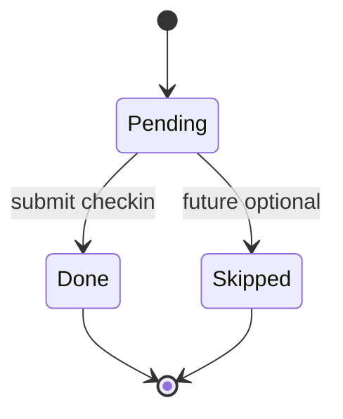
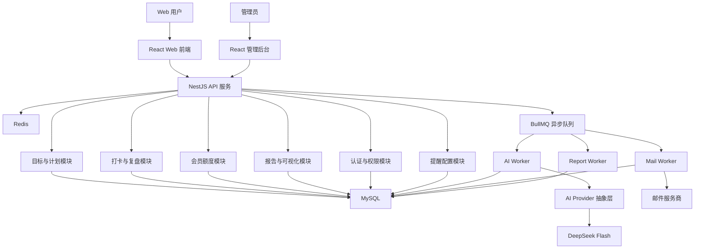
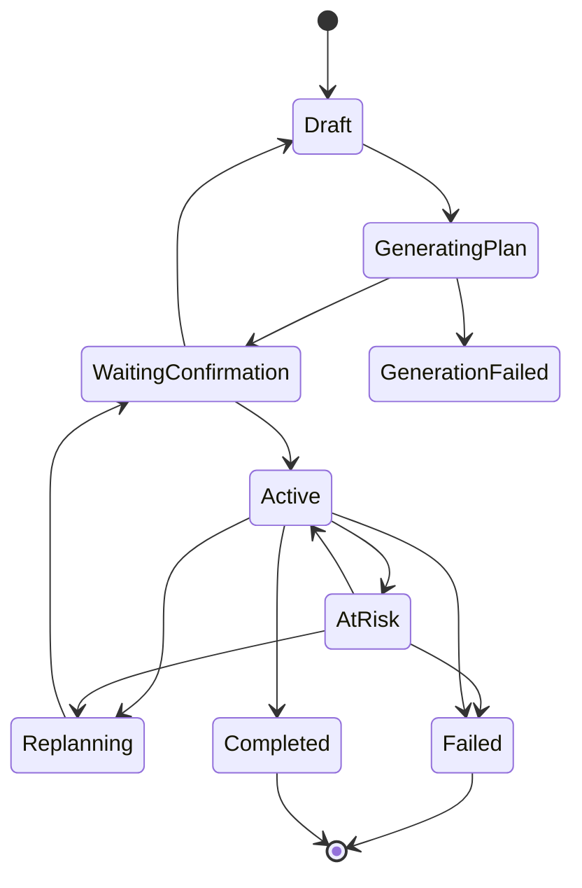
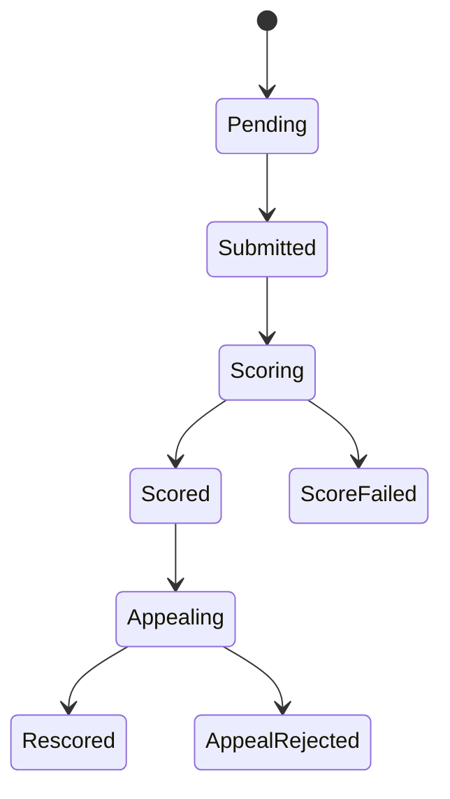
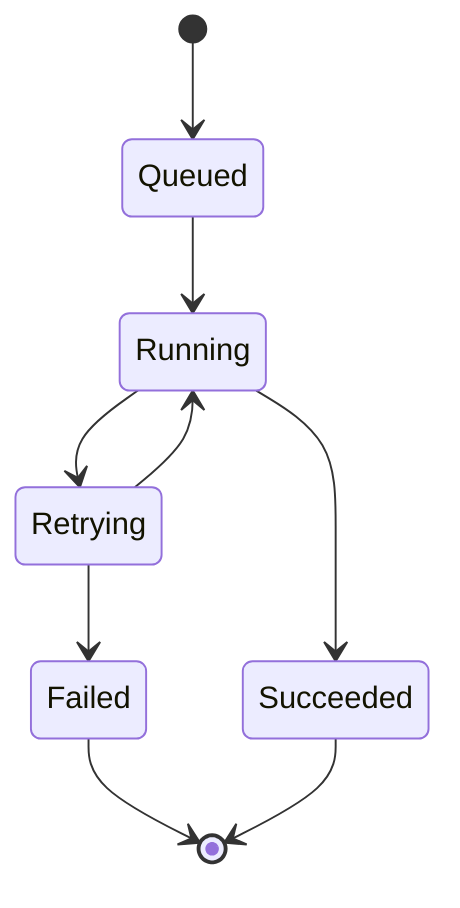

# GoalPilot AI SPEC

## 1. 项目定位

GoalPilot AI 是一个基于 AI 的目标陪跑与成长可视化平台。用户输入一个长期目标后，系统通过结构化表单和 AI 辅助追问，帮助用户拆解阶段计划、每周计划和每日任务，并在执行过程中提供每日打卡、复盘评分、计划偏差检测、动态调整建议、失败保护、救援任务、奖励愿景板、任务完成热力图、目标健康报告和成长时间线。

GoalPilot AI 不是普通 Todo List，也不是普通打卡网站。核心差异在于：

1. AI 目标拆解
2. 每日打卡与复盘
3. 基于规则约束的动态计划校正建议
4. 失败保护和救援任务机制
5. 目标奖励锚点和奖励愿景板
6. GitHub Contributions 风格的每日任务完成热力图
7. 目标健康报告和成长时间线

## 2. MVP 产品范围

### 2.1 首发平台

- 第一版只做 Web 端。
- 前后端分离。
- 小程序暂不开发，但后端接口设计预留多端能力。

### 2.2 首发用户场景

产品愿景保持泛化，但 MVP 优先支持以下可拆解、可每日执行、可复盘的目标类型：

- 学习考证
- 职业技能成长
- 健身减脂
- 自律习惯

系统允许用户自由输入目标，由 AI 自动识别目标类型并补齐结构化信息。

### 2.3 MVP 核心闭环

MVP 第一验收目标是完整跑通：

创建目标 -> AI 拆解计划 -> 用户确认 -> 每日任务执行 -> 文本打卡 -> AI 多维评分 -> 偏差检测 -> 救援或调整建议 -> 目标完成或失败复盘。

## 3. 成功标准

### 3.1 产品成功指标

- 用户能够完成从目标创建到执行闭环的完整流程。
- 用户能够理解并接受 AI 拆解出的阶段计划、每周计划和每日任务。
- 用户每日打卡后能在 1 分钟内获得 AI 评分或明确的异步处理状态。
- 系统能根据未完成、低评分、延期、低投入、负面复盘内容等信号触发偏差提醒。
- 用户在失败后能看到失败复盘，并能重新开启新目标。

### 3.2 MVP 规模目标

- 先支持约 100 名用户。
- AI 目标生成在 1 分钟内返回结果或进入失败提示。
- AI 打卡评分在 1 分钟内返回结果或进入失败提示。

## 4. 用户角色

### 4.1 前台用户

普通用户可以：

- 邮箱注册和登录。
- 创建长期目标。
- 查看目标列表并切换当前目标。
- 填写目标约束信息。
- 查看 AI 生成计划。
- 确认计划后进入执行。
- 每日查看任务。
- 提交文本打卡内容。
- 查看 AI 评分和总结建议。
- 查看热力图、成长时间线、健康报告。
- 设置提醒偏好。
- 管理奖励愿景板。
- 对 AI 评分发起申诉复评。
- 在目标失败后查看失败报告，并重新开启新目标。

### 4.2 会员用户

会员用户在普通用户基础上获得更高额度：

- 更多进行中目标数量。
- 更多 AI 生成和评分次数。
- 更多申诉次数。
- 更完整的目标健康报告。
- 更高级的奖励愿景板能力。

MVP 不接入真实支付，只保留会员状态字段，由后台手动开通。

### 4.3 后台角色

后台建议分为三级权限：

- 运营管理员：用户基础信息、目标状态、邮件日志、会员状态管理。
- 系统管理员：异步任务、AI 调用日志、系统配置、异常任务处理。
- 超级管理员：可在审计记录下查看用户原始目标、复盘内容、敏感内容和完整审计日志。

## 5. 核心用户流程

### 5.1 注册登录

- MVP 使用邮箱注册和登录。
- 支持邮箱验证码或邮箱密码登录，具体实现可在技术设计阶段二选一。
- 用户登录后默认进入创建目标引导页。

### 5.2 创建目标

创建目标采用“表单 + AI 辅助”模式。

用户需要填写：

- 目标描述
- 开始日期
- 结束日期
- 目标天数
- 每日可投入时间
- 当前基础
- 主要限制
- 允许断签或失败容错次数
- 最终奖励
- 阶段奖励
- 每日邮件提醒时间

AI 负责：

- 识别目标类型。
- 判断目标是否可拆解、可每日执行、可复盘。
- 发现目标时间、投入或难度是否明显不现实。
- 必要时生成补充问题。
- 生成长期目标拆解计划。

如果目标明显不现实，系统强提醒，但允许用户继续创建。

### 5.2.1 目标列表和当前目标

用户可以查看自己创建的目标列表，列表至少展示：

- 目标标题和描述
- 目标状态
- 目标类型
- 起止日期
- 容错次数

前端需要维护“当前选中目标”。今日任务、热力图、健康报告、计划确认等页面默认围绕当前选中目标展示。

当前目标驾驶舱需要作为目标列表页的主工作区，至少展示：

- 当前目标标题、描述和状态。
- 今日任务完成进度。
- 目标健康度、连续执行和容错剩余等关键指标。
- 最近 3 条复盘记录，包含任务标题、日期、投入时间和 AI 评分。
- 下一步主动作：生成 AI 计划、确认计划、完成今日任务或查看成长记录。
- 快速入口：今日任务、成长热力图、成长时间线、奖励愿景板。

默认选择规则：

1. 优先选择最近的 ACTIVE 或 AT_RISK 目标。
2. 没有进行中目标时，选择最近的 WAITING_CONFIRMATION 目标。
3. 仍没有时，选择最近创建的草稿目标。
4. 没有目标时，引导用户创建目标。

MVP 可以限制免费用户同时只有 1 个进行中目标，但目标列表仍需保留历史目标和草稿目标。

### 5.3 AI 计划拆解

计划层级：

1. 长期目标
2. 阶段里程碑
3. 每周计划
4. 每日任务

AI 生成计划后必须由用户确认。用户确认前，计划不进入执行状态。

AI 计划确认页需要完整展示：

- 计划摘要。
- 阶段里程碑。
- 每周计划。
- 每日任务标题、描述、日期和预计投入。
- 计划统计：里程碑数、周计划数、每日任务数、确认状态。
- 确认前检查项：阶段目标是否清晰、每周节奏是否可执行、每日任务是否具体、投入时间是否符合现实约束。

计划确认页必须支持从后端重新读取当前目标计划，避免用户刷新页面后丢失待确认计划。

### 5.4 每日任务和打卡

每日任务由系统按计划生成。

当用户存在多个目标时，今日任务接口和页面必须支持按当前目标过滤，避免不同目标的任务混在一起。

MVP 打卡只支持文本内容，包含：

- 今日完成了什么
- 投入时间
- 完成证据或过程描述
- 遇到的问题
- 主观状态和复盘

用户提交后，后端创建 AI 评分任务。

MVP 阶段先使用 Mock AI scorer：

- 创建 `CHECKIN_SCORING` 类型的 AiJob。
- 状态流转复用 `QUEUED / RUNNING / SUCCEEDED / FAILED`。
- Mock scorer 根据复盘文本长度、实际投入时间和计划投入时间生成总分、维度分、总结和建议。
- 评分结果写入 `ai_scores`，并和 `checkins` 关联。

打卡提交后前端展示复盘结果面板，至少包含：

- 完成内容
- 实际投入时间
- Mock AI 总分和维度分
- AI 总结和明日建议
- 评分 job 状态
- 对热力图和健康度更新的提示

### 5.5 AI 多维评分

AI 对每日完成情况进行多维评分，并给出证据和建议。

建议评分维度：

- 任务完成度
- 投入时长匹配度
- 完成质量
- 目标相关性
- 复盘深度
- 连续性和执行稳定性

输出内容：

- 各维度分数
- 总分
- 评分证据
- 今日总结
- 明日建议
- 风险提示

前端需要提供类似雷达图、柱状图或环形维度图的可视化，不强制必须是六边形图。

### 5.6 AI 评分申诉

用户不能手动修改评分。

用户可以发起 AI 申诉复评，但申诉必须基于新增事实：

- 追加完成证据
- 追加投入说明
- 纠正原打卡中遗漏的信息

AI 复评约束：

- 只依据任务要求、原始提交内容和新增事实。
- 不被情绪化话术、威胁、讨好、诱导性提示影响。
- 每个维度必须使用固定 rubric。
- 每项评分必须给出证据。
- 无新增事实的申诉应维持原评分。

### 5.7 偏差检测

系统同时使用规则和 AI 识别偏差。

偏差信号包括：

- 连续未完成天数
- 累计未完成次数
- 完成分数低于阈值
- 任务延期
- 实际投入低于计划
- 阶段里程碑进度落后
- 复盘中出现“太难”“没时间”“不想做”“压力大”等负面信号
- 容错次数即将耗尽

偏差处理：

- 轻度偏差：提示风险和明日建议。
- 中度偏差：建议降低难度、调整任务粒度或生成救援任务。
- 重度偏差：触发重规划建议。
- 超过容错次数：判定当前目标失败。

MVP 偏差检测先使用规则引擎，输出统一 `deviation` 信号：

- `eventId`: 偏差事件 ID；稳定状态下为空。
- `detectedAt`: 偏差事件检测时间；稳定状态下为空。
- `riskLevel`: `stable / warning / danger`。
- `reasons`: 触发原因数组，原因码包括 `LOW_SCORE / LOW_INVESTMENT / BROKEN_STREAK / TASK_DELAY`。
- `metrics`: 最近平均分、近 7 天实际投入、近 7 天预期投入、连续天数、延期任务数、今日未完成任务数。

MVP 触发规则：

- 低评分：近 7 天平均 AI 评分低于 70 触发 `warning`，低于 60 触发 `danger`。
- 低投入：近 7 天实际投入低于预期投入 80% 触发 `warning`，低于 50% 触发 `danger`。
- 断签：连续完成天数为 0 且存在今日任务或近 7 天复盘记录时触发；若今日仍有未完成任务，触发 `danger`。
- 任务延期：今天之前仍未完成的任务数大于 0 触发 `warning`，大于等于 3 触发 `danger`。

MVP 偏差事件持久化：

- 新增 `deviation_events` 表保存偏差检测结果。
- 仅当 `riskLevel` 为 `warning` 或 `danger` 时写入事件；`stable` 不生成偏差事件。
- 事件保存 `goalId`、可选 `sourceDailyTaskId`、风险等级、主触发原因、完整 `reasons` JSON、`metrics` JSON 和 `detectedAt`。
- 为避免健康报告反复刷新制造重复数据，同一目标、同一自然日、同一主触发原因复用同一偏差事件，并更新最新指标快照。
- 健康报告和救援任务接口返回的 `deviation.eventId` 指向该偏差事件，后续时间线、趋势和救援效果统计均以此作为链路入口。

### 5.8 救援任务机制

救援任务用于防止用户因为一次低质量执行直接放弃。

触发条件：

- 当日任务未完成。
- 当日评分明显低于阈值。
- 用户接近断签。
- 用户复盘中表现出强阻力。

救援任务特征：

- 更小。
- 更短。
- 更低门槛。
- 能维持目标连续性。
- 不替代原计划，只作为恢复执行状态的最小任务。

示例：

- 原任务：学习 2 小时。
- 救援任务：学习 15 分钟并写下 3 个知识点。

MVP 新增接口：

- `POST /goals/:id/rescue-task`
- 请求需要登录态，不需要请求体。
- 响应包含 `goalId`、`goalTitle`、最新 `deviation` 和 `rescueTask`。

MVP `rescueTask` 字段：

- `id`: 已持久化的每日任务 ID。
- `title`: 补救任务标题。
- `description`: 低压力执行说明。
- `estimatedMinutes`: 预计投入时间，建议 10-25 分钟。
- `reason`: 生成原因，来自主要偏差信号。
- `triggerCode`: 触发原因码，稳定状态下可为空。
- `riskLevel`: 生成时的偏差风险等级。
- `sourceDailyTaskId`: 可选，指向触发补救的未完成或延期任务。
- `deviationEventId`: 可选，指向触发该救援任务的偏差事件。
- `status`: 复用每日任务状态。
- `createdAt`: 生成时间。

MVP 持久化策略：

- 不新增独立 `RescueTask` 表，先在 `daily_tasks` 增加 `taskType` 和救援元数据字段。
- 普通任务 `taskType=NORMAL`，救援任务 `taskType=RESCUE`。
- 救援任务保存标题、说明、预计时间、触发原因、风险等级、状态、`goalId`、可选 `sourceDailyTaskId` 和可选 `deviationEventId`。
- `POST /goals/:id/rescue-task` 生成后直接创建或复用当日未完成救援任务，并返回已持久化的任务对象。
- 若当日已存在未完成救援任务，则复用该任务和已关联的偏差事件；若是旧数据缺少 `deviationEventId`，会补写当天对应偏差事件。
- 前端今日任务列表直接读取后端任务，不再维护临时救援任务。

状态流转：

完成闭环：

- 救援任务完成接口复用 `POST /daily-tasks/:id/complete`。
- 完成时创建 `checkins`，创建 `CHECKIN_SCORING` AiJob，并写入 `ai_scores`。
- 评分证据中保留 `taskType=RESCUE`、`deviationEventId`、触发原因码和生成时风险等级。
- 完成后刷新今日任务、健康报告、热力图和成长时间线。

### 5.9 目标失败

目标失败规则：

- 到达结束日期前，未完成不会立刻判定整体失败。
- 用户创建目标时可设置容错次数。
- 超过容错次数后，当前目标判定失败。

目标失败后：

- 当前目标进入失败状态。
- 系统生成失败总结复盘。
- 旧目标保留为历史参考。
- 用户可以重新开启一个全新的目标。
- 新目标和旧目标不是同一目标版本关系，而是新的目标记录。

失败报告应包含：

- 失败原因分析
- 断签时间线
- 低分任务列表
- 关键偏差节点
- AI 复盘建议
- 重新开启计划入口

### 5.10 目标完成

目标完成规则：

- 到达结束日期。
- 未超过容错次数。

不额外强制要求平均分、累计完成率或里程碑完成率达到阈值。相关指标作为健康报告展示。

### 5.11 计划修改

用户可在执行中申请修改：

- 结束日期
- 每日投入时间
- 奖励
- 任务难度
- 计划节奏

修改不能直接生效，必须触发 AI 重新评估并生成新计划。

新计划需要用户确认后生效。

## 6. 奖励愿景板

奖励愿景板用于增强目标锚定感。

MVP 支持：

- 最终奖励
- 阶段奖励
- 文字奖励卡片
- 图片上传
- 外链图片
- 愿望卡片排序

奖励触发：

- 达成阶段里程碑时提醒阶段奖励。
- 最终目标完成时提醒最终奖励。

## 7. 热力图和成长可视化

### 7.1 热力图

热力图采用类似 GitHub Contributions 的日历式布局。

当用户存在多个目标时，热力图默认展示当前选中目标的数据。用户切换当前目标后，热力图、日期详情和健康报告需要同步切换。

点击某天方块时，日期详情需要展示当天所有复盘记录和 AI 建议，并提供跳转到当天成长时间线记录的入口。

颜色深浅综合参考：

- AI 总评分
- 任务完成比例
- 投入时长
- 目标健康度

热力图不只展示是否完成。

### 7.2 目标健康报告

健康报告基础版包含：

- 当前目标状态
- 总体完成率
- 平均 AI 评分
- 容错次数剩余
- 连续执行天数
- 低分日期
- 偏差趋势
- AI 风险建议
- 偏差风险等级和触发原因
- 救援任务生成入口

健康报告和今日任务联动：

- 健康报告接口返回 `deviation`，前端根据 `riskLevel` 展示稳定、预警或危险状态。
- 当 `riskLevel` 为 `warning` 或 `danger` 时，今日任务页顶部显示偏差提醒，列出触发原因。
- 用户可以从健康报告风险卡片或今日任务页生成救援任务。
- 生成后的救援任务作为 `taskType=RESCUE` 的正式每日任务出现在今日任务列表顶部或同日任务流中，不替代原计划任务。
- 救援任务完成后计入当日完成数、热力图等级、投入分钟、平均评分和健康度计算。
- 未完成救援任务也参与今日未完成任务与偏差检测，避免生成后无人处理。

### 7.3 成长时间线

时间线展示：

- 目标创建
- 计划确认
- 阶段里程碑
- 每日关键打卡
- 偏差提醒
- 救援任务
- 计划重评估
- 目标完成或失败

MVP 优先实现基于每日复盘的成长时间线：

- 后端提供 `GET /daily-tasks/timeline?goalId=...`。
- 接口按当前用户授权读取数据，并支持按当前目标过滤。
- 返回最近完成任务、checkin、aiScore、日期、投入时间、目标标题、周计划标题和任务标题。
- 返回数据需要同时包含扁平 `items` 和按日期聚合的 `days`，便于页面和热力图详情复用。
- 每条记录至少展示任务标题、复盘摘要、投入时间、AI 总分、AI 总结和 AI 建议。
- 救援任务复盘必须标记“救援任务复盘”，展示触发原因、风险等级和补救效果。
- 空状态引导用户先完成今日任务。

成长时间线需要和现有页面联动：

- 热力图选中某天后，详情区展示当天所有复盘和建议，并可跳转到时间线当天记录。
- 当前目标驾驶舱展示最近 3 条复盘记录，点击后进入对应日期的成长时间线。
- 切换当前目标后，今日任务、热力图、健康报告和成长时间线都必须同步切换。

## 8. 邮件提醒

MVP 使用邮件提醒。

用户可配置：

- 是否开启邮件提醒
- 每日提醒时间
- 接收哪些提醒类型

提醒类型：

- 每日任务提醒
- 当天未打卡提醒
- 容错次数即将耗尽提醒
- 阶段里程碑提醒
- 失败复盘提醒
- 会员到期提醒

截止时间规则：

- 截止时间严格按自然日计算。
- 默认使用北京时间。
- 用户可以自定义提醒时间，但不改变当日截止规则。

## 9. 商业化

MVP 不接入真实支付。

商业化能力包括：

- 用户会员状态字段
- 会员到期时间
- 后台手动开通会员
- 免费版额度限制
- 会员版额度解锁

建议免费版限制：

- 仅允许 1 个进行中目标。
- 每日 AI 评分次数有限。
- 每周 AI 调整建议次数有限。
- 申诉次数有限。
- 目标健康报告为基础版。
- 奖励愿景板素材数量有限。

建议会员版能力：

- 多个进行中目标。
- 更多 AI 评分、复盘、调整建议。
- 更多申诉次数。
- 深度健康报告。
- 高级奖励愿景板。

## 10. 管理后台

后台 MVP 功能：

- 用户管理
- 目标列表
- 目标状态查看
- AI 调用记录
- 异步任务状态
- 会员管理
- 邮件提醒日志
- 系统配置
- 敏感内容和异常内容查看
- 审计日志

隐私约束：

- 默认后台页面优先展示摘要、状态和指标。
- 超级管理员查看用户原文必须记录审计日志。
- 审计日志记录查看人、查看时间、查看原因、查看对象。

## 11. 隐私和安全

MVP 需要重视私人目标、复盘内容和奖励愿景板数据。

基础要求：

- 用户可删除自己的目标数据。
- 用户可删除账号及全部数据。
- AI 调用前尽量减少不必要个人身份信息。
- 敏感内容加密存储，至少对关键字段预留加密能力。
- 后台权限分级。
- 超级管理员查看原文需审计。
- 记录关键操作审计日志。

## 12. 技术架构

### 12.1 技术选型

前端：

- React
- TypeScript
- Vite

后端：

- NestJS
- TypeScript

数据库：

- MySQL

缓存和异步队列：

- Redis
- BullMQ

AI：

- DeepSeek Flash 作为主要 AI 供应商
- 后端保留 AI Provider 抽象，支持未来切换模型供应商

邮件：

- 通过邮件服务商发送提醒邮件
- 邮件发送任务进入异步队列

### 12.2 架构图

### 12.3 后端模块

- Auth Module：邮箱注册、登录、会话、权限。
- User Module：用户资料、提醒偏好、隐私设置。
- Goal Module：目标创建、目标状态、容错次数、完成或失败。
- Plan Module：阶段计划、每周计划、每日任务、计划确认、计划重评估。
- Checkin Module：每日打卡、文本内容、评分状态。
- Scoring Module：AI 评分、rubric、申诉复评。
- Deviation Module：偏差检测、救援任务、风险等级。
- Reward Module：奖励愿景板、图片、外链、排序。
- Heatmap Module：热力图数据聚合。
- Report Module：健康报告、成长时间线、失败报告。
- Membership Module：会员状态、额度限制。
- Admin Module：后台管理、审计日志。
- Notification Module：邮件提醒配置和发送日志。
- AI Provider Module：模型供应商抽象、调用记录、重试、失败终止。
- Queue Module：异步任务调度。

## 13. 关键数据模型

核心表建议：

- users
- user_auth_identities
- user_preferences
- memberships
- goals
- goal_constraints
- plans
- milestones
- weekly_plans
- daily_tasks
- checkins
- ai_scores
- ai_score_dimensions
- score_appeals
- deviation_events
- rescue_tasks（后续独立表；MVP 使用 `daily_tasks.taskType=RESCUE`）
- reward_boards
- reward_cards
- heatmap_daily_stats
- health_reports
- timeline_events
- notifications
- email_logs
- ai_jobs
- ai_call_logs
- admin_users
- admin_roles
- audit_logs
- system_configs

MVP 已落地的偏差和救援相关字段：

- `deviation_events`: 记录目标偏差事件、主触发原因、风险等级、完整原因 JSON、指标快照 JSON、检测时间和可选来源任务。
- `daily_tasks.taskType`: 区分 `NORMAL` 和 `RESCUE`。
- `daily_tasks.sourceDailyTaskId`: 记录救援任务来源的延期或未完成任务 ID。
- `daily_tasks.deviationEventId`: 记录救援任务对应的偏差事件 ID。
- `daily_tasks.rescueReason / rescueTriggerCode / rescueRiskLevel`: 保存救援任务生成时的偏差信号摘要。

## 14. 状态机

### 14.1 目标状态

### 14.2 每日打卡状态

### 14.3 AI 异步任务状态

## 15. AI 任务和失败兜底

AI 任务包括：

- 目标类型识别
- 目标可行性判断
- 阶段计划生成
- 每日任务生成
- 打卡评分
- 申诉复评
- 偏差总结
- 救援任务生成
- 计划重评估
- 健康报告生成
- 失败报告生成

失败处理：

- AI 调用超时或失败时自动重试。
- 用户侧显示“生成中”或“评分中，请稍后查看”。
- 超过最大失败次数后终止任务。
- 终止后提示用户“生成失败”或“评分失败”。
- 后台记录异常任务，便于管理员排查。

## 16. API 边界

前端职责：

- 页面展示
- 表单交互
- 打卡提交
- 可视化展示
- 用户配置

后端职责：

- 认证和权限
- 所有 AI 调用
- 评分规则和 rubric
- 反诱导约束
- 偏差检测
- 目标状态流转
- 会员额度控制
- 邮件提醒调度
- 审计日志

原则：

- 前端不直接调用 AI。
- 前端不自行计算关键目标状态。
- 前端不拥有评分最终解释权。
- 规则、AI 调用和数据一致性由后端统一控制。

## 17. UI/UX 要求

整体风格：

- 温暖陪伴型。
- 不做冰冷的普通 Todo List。
- 不做纯游戏化，但允许适度成长感和奖励感。

登录后第一屏：

- 未创建目标时展示创建目标引导页。
- 已有进行中目标时可进入当前目标驾驶舱。
- 已有多个目标时，系统根据默认选择规则选中当前目标，并允许用户从目标列表切换。

核心页面：

- 创建目标引导页
- 目标列表页
- AI 计划确认页
- 当前目标驾驶舱
- 今日任务页
- 打卡复盘页
- AI 评分结果页
- 热力图页
- 成长时间线页
- 健康报告页
- 奖励愿景板页
- 失败复盘页
- 个人设置页
- 会员状态页
- 管理后台

## 18. 非功能需求

性能：

- 目标生成和评分允许异步，目标在 1 分钟内有结果或失败提示。
- 常规页面接口应在 1 秒内返回。

可扩展性：

- 保留多端接口能力。
- AI Provider 可切换。
- 异步任务可横向扩展。

安全：

- 密码或邮箱登录凭证安全存储。
- 后台权限分级。
- 原文查看必须审计。
- 用户敏感内容和关键隐私字段预留加密。

成本：

- 使用 DeepSeek Flash 作为主模型控制成本。
- 规则检测优先，复杂建议再调用 AI。
- 对免费用户限制 AI 次数。

可靠性：

- AI 任务失败重试。
- 邮件发送失败记录和重试。
- 异步任务可追踪。

## 19. 边缘案例和异常处理

- 用户输入过于抽象目标：AI 提示需要改写为可拆解、可每日执行、可复盘目标。
- 用户目标时间明显不现实：强提醒，但允许继续。
- 用户未确认计划：目标保持待确认，不生成每日执行任务。
- 用户当天未打卡：记录未完成，按容错规则处理。
- 用户提交极短或无意义打卡：AI 按 rubric 给低分并说明证据不足。
- 用户诱导 AI 改分：申诉失败，维持原评分。
- 用户修改计划：进入重评估流程，新计划确认后才生效。
- AI 多次失败：终止任务，提示失败，后台记录异常。
- 邮件发送失败：记录失败日志并按策略重试。
- 超过容错次数：目标失败并生成失败报告。
- 到达结束日期且未超过容错次数：目标完成。

## 20. TODO 清单

### 20.1 产品设计

- 明确免费版和会员版额度数字。
- 设计目标创建表单。
- 设计 AI 追问和补全流程。
- 设计评分 rubric。
- 设计偏差等级和触发规则。
- 设计失败报告内容结构。
- 设计邮件提醒模板。
- 设计后台权限和审计交互。

### 20.2 前端

- 搭建 React + TypeScript + Vite 项目。
- 实现邮箱登录和注册页面。
- 实现创建目标引导页。
- 实现 AI 计划确认页。
- 实现当前目标驾驶舱。
- 实现今日任务和文本打卡。
- 实现 AI 评分展示和维度图。
- 实现热力图。
- 实现成长时间线。
- 实现健康报告。
- 实现奖励愿景板。
- 实现失败复盘页。
- 实现用户提醒配置页。
- 实现会员状态页。
- 实现管理后台基础页面。

### 20.3 后端

- 搭建 NestJS 项目。
- 设计 MySQL schema。
- 接入 Redis 和 BullMQ。
- 实现认证和权限。
- 实现目标、计划、任务模型。
- 实现 AI Provider 抽象层。
- 接入 DeepSeek Flash。
- 实现计划生成异步任务。
- 实现打卡评分异步任务。
- 实现评分申诉复评。
- 实现偏差检测规则。
- 实现救援任务生成。
- 实现目标完成和失败状态流转。
- 实现奖励愿景板接口。
- 实现热力图聚合接口。
- 实现健康报告和时间线。
- 实现邮件提醒任务。
- 实现会员额度限制。
- 实现后台管理接口。
- 实现审计日志。

### 20.4 运维和配置

- 配置环境变量。
- 配置数据库迁移。
- 配置日志。
- 配置异步任务监控。
- 配置邮件服务商。
- 配置 AI 调用超时和重试策略。
- 配置后台系统参数。

## 21. 验收标准

### 21.1 核心闭环验收

- 用户可以通过邮箱注册和登录。
- 用户登录后进入创建目标引导页。
- 用户可以填写目标信息、容错次数、奖励和提醒时间。
- AI 可以生成阶段里程碑、每周计划和每日任务。
- 用户确认计划后目标进入执行状态。
- 用户可以完成每日文本打卡。
- AI 可以异步生成多维评分、总分、证据和建议。
- 系统可以根据评分和完成情况生成偏差提醒。
- 系统可以生成救援任务或调整建议。
- 超过容错次数后目标进入失败状态。
- 失败目标可以生成失败报告。
- 用户可以重新开启一个新目标。
- 到达结束日期且未超过容错次数时目标完成。

### 21.2 可视化验收

- 用户可以查看每日热力图。
- 热力图颜色深浅综合反映 AI 总评分、完成比例、投入时长和目标健康度。
- 用户可以查看目标健康报告。
- 用户可以查看成长时间线。
- 用户可以维护奖励愿景板。

### 21.3 管理后台验收

- 管理员可以登录后台。
- 管理员可以查看用户、目标、AI 调用、异步任务、邮件日志和会员状态。
- 后台可以手动开通会员。
- 超级管理员查看用户原文时必须生成审计日志。

### 21.4 异常验收

- AI 失败会自动重试。
- 超过失败次数后任务终止并提示生成失败。
- 邮件发送失败会记录日志。
- 用户诱导 AI 改分时，申诉不能绕过 rubric。
- 用户修改执行中计划时，必须触发 AI 重评估并生成新计划。
